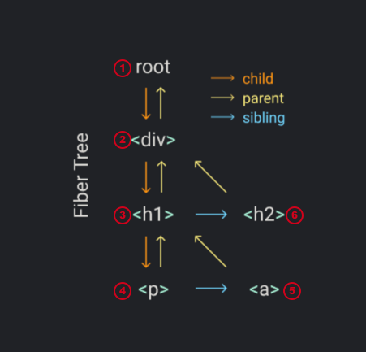

https://pomb.us/build-your-own-react/

## Review


```jsx
const element = <h1 title="foo">Hello</h1>
const container = document.getElementById("root")
ReactDOM.render(element, container)
```

### element

```js
// const element = <h1 title="foo">Hello</h1>
const element = React.createElement(
    "h1", { title: "foo" },
    "Hello"
)
const container = document.getElementById("root")
ReactDOM.render(element, container)
```

```js
// const element = <h1 title="foo">Hello</h1>
const element = {
    type: "h1",
    props: {
        title: "foo",
        children: "Hello",
    },
}
const container = document.getElementById("root")
ReactDOM.render(element, container)
```

### render

```js
// const element = <h1 title="foo">Hello</h1>
const element = {
    type: "h1",
    props: {
        title: "foo",
        children: "Hello",
    },
}
const container = document.getElementById("root")

// ReactDOM.render(element, container)

const node = document.createElement(element.type)
node["title"] = element.props.title

const text = document.createTextNode("")
text["nodeValue"] = element.props.children

node.appendChild(text)
container.appendChild(node)
```

## The `createElement` Function

```js
const element = React.createElement(
    "div", { id: "foo" },
    React.createElement("a", null, "bar"),
    React.createElement("b")
)

const container = document.getElementById("root")
ReactDOM.render(element, container)
```

### createElement

```js
function createElement(type, props, ...children) {
    return {
        type,
        props: {
            ...props,
            children,
        },
    }
}

createElement("div")
/*
{
  "type": "div",
  "props": { "children": [] }
}
*/

createElement("div", null, a, b)
/*
{
  "type": "div",
  "props": { "children": [a, b] }
}
*/
```

```js
function createElement(type, props, ...children) {
    return {
        type,
        props: {
            ...props,
            // children 可能是 string 或 numbers
            children: children.map(child =>
                typeof child === "object" ?
                child :
                createTextElement(child)
            ),
        },
    }
}

function createTextElement(text) {
    return {
        type: "TEXT_ELEMENT", // 自定义为 TEXT_ELEMENT 类型
        props: {
            nodeValue: text,
            children: [], // 简化 (React 对于基本类型或没有 children 时并没有创建一个空数组)
        },
    }
}

const MyReact = {
    createElement,
}

const element = MyReact.createElement(
    "div", { id: "foo" },
    MyReact.createElement("a", null, "bar"),
    MyReact.createElement("b")
)
```

 ### babel

**Tell  to use MyReact’s createElement instead of React’s**

- If we have a **comment** like below, when babel transpiles the JSX it will use the function we define
  - 添加如下注释，babel 将会调用注释中的函数来转换 JSX

```jsx
/** @jsx MyReact.createElement */
const element = (
    <div id="foo">
        <a>bar</a>
        <b />
    </div>
)
```

##  The `render` Function

```jsx
/** @jsx MyReact.createElement */
const element = (
    <div id="foo">
        <a>bar</a>
        <b />
    </div>
)
const container = document.getElementById("root")
ReactDOM.render(element, container)
```

### append to the DOM

```js
// ...
function render(element, container) {
    const dom = document.createElement(element.type)
    // 迭代 children
    element.props.children.forEach(child =>
        render(child, dom)
    )
    container.appendChild(dom)
}
// ...
```
### props
```js
// ...
function render(element, container) {
    const dom = element.type == "TEXT_ELEMENT" // 自定义的 TEXT_ELEMENT 类型时创建 text node
        ?
        document.createTextNode("") :
        document.createElement(element.type)

    // 属性
    const isProperty = key => key !== "children"
    Object.keys(element.props)
        .filter(isProperty)
        .forEach(name => {
            dom[name] = element.props[name]
        })

    // 迭代 children
    element.props.children.forEach(child =>
        render(child, dom)
    )
    container.appendChild(dom)
}
// ...
```

## Concurrent Mode

```js
// ...
function render(element, container) {
    //...
    // 迭代 children, 只有渲染完整个树时，此迭代才会结束，因此会阻塞整个主线程
    element.props.children.forEach(child =>
        render(child, dom)
    )
    //...
}
// ...
```

### Break the work into small units

- after we finish each unit we’ll let the browser interrupt the rendering if there’s anything else that needs to be done
  - 完成每个小单元任务后，浏览器在此时可以有机会去完成其他任务
- We use `requestIdleCallback` to make a loop
  - `requestIdleCallback` also gives us a **deadline** parameter. 
  - We can use it to **check how much time we have** until the browser needs to take control again.
  - To start using the loop we’ll need to **set the first unit of work**, and then write a `performUnitOfWork` function that not only **performs the work** but also **returns the next unit of work**.
    - `performUnitOfWork` 完成当下小单元的任务，并返回下一个待处理的小单元任务
- *React [doesn’t use `requestIdleCallback` anymore](https://github.com/facebook/react/issues/11171#issuecomment-417349573). Now it uses the [scheduler package](https://github.com/facebook/react/tree/master/packages/scheduler).*

```js
// ...
let nextUnitOfWork = null

function workLoop(deadline) {
    let shouldYield = false
    while (nextUnitOfWork && !shouldYield) {
        nextUnitOfWork = performUnitOfWork(nextUnitOfWork) // 完成当下任务，并返回下一个任务
        shouldYield = deadline.timeRemaining() < 1
    }
    requestIdleCallback(workLoop)
}

requestIdleCallback(workLoop)

function performUnitOfWork(nextUnitOfWork) {
    // TODO 
}
// ...
```

## Fibers

### Fiber tree

**To organize the units of work we’ll need a data structure: a fiber tree.**

- We’ll have **one fiber for each element** and **each fiber will be a unit of work**.
  - 一个 fiber 对应一个 element
  - 每个 fiber 就是一个小单元任务

```jsx
MyReact.render(
    <div>
        <h1>
            <p />
            <a />
        </h1>
        <h2 />
    </div>,
    container
)
```

- In the `render` we’ll create the root fiber and set it as the `nextUnitOfWork`.
  - 在 `render` 负责创建 root fiber, 并将其作为 `nextUnitOfWork`
- 剩下的任务将在 `performUnitOfWork` 函数中完成
- 每个 fiber 需要做三件事
  - add the element to the dom
    - 添加 element 到 dom 上
  - create the fibers for the element’s children
    - 将 element 的 children 都创建为对应的 fiber
  - select the next unit of work
    - 选择并返回下个任务 `nextUnitOfWork`
- Make it easy to find the next unit of work. That’s why **each fiber has a link to its first child, its next sibling and its parent**.
  - 每个 fiber 都有 link 链到其第一个子元素, 下一个兄弟元素，和其父元素
  - 选择 `nextUnitOfWork` 的 fiber 的顺序
    - 子元素
    - 兄弟元素
    - 父元素的兄弟元素



### createDom

```jsx
function createDom(fiber) {
    const dom =
        fiber.type == "TEXT_ELEMENT" ?
        document.createTextNode("") :
        document.createElement(fiber.type)
    const isProperty = key => key !== "children"
    Object.keys(fiber.props)
        .filter(isProperty)
        .forEach(name => {
            dom[name] = fiber.props[name]
        })
    return dom
}

function render(element, container) {
    // TODO set next unit of work
}
// ...
```

### nextUnitOfWork

```js
// ...
function render(element, container) {
    nextUnitOfWork = { // 创建 root fiber, 并将其作为 nextUnitOfWork
        dom: container,
        props: {
            children: [element],
        },
    }
}

let nextUnitOfWork = null
// ...
```

### workLoop

- when the browser is **ready**, it will call our `workLoop` and we’ll start working on the **root**

```js
// ...
function workLoop(deadline) {
    let shouldYield = false
    while (nextUnitOfWork && !shouldYield) {
        nextUnitOfWork = performUnitOfWork(
            nextUnitOfWork
        )
        shouldYield = deadline.timeRemaining() < 1
    }
    requestIdleCallback(workLoop)
}

requestIdleCallback(workLoop)

function performUnitOfWork(fiber) {
    // TODO add dom node
    // TODO create new fibers
    // TODO return next unit of work
}
// ...
```

### performUnitOfWork

```js
// ...
function performUnitOfWork(fiber) {
    // create a new node and append it to the dom
    if (!fiber.dom) {
        fiber.dom = createDom(fiber)
    }
    if (fiber.parent) {
        fiber.parent.dom.appendChild(fiber.dom)
    }

    // for each child we create a new fiber
    const elements = fiber.props.children
    let index = 0
    let prevSibling = null
    while (index < elements.length) {
        const element = elements[index]
        const newFiber = {
            type: element.type,
            props: element.props,
            parent: fiber,
            dom: null,
        }
        // we add it to the fiber tree setting it either as a child or as a sibling 
        // depending on whether it’s the first child or not
        if (index === 0) {
            fiber.child = newFiber // as a child
        } else {
            prevSibling.sibling = newFiber // as a sibling
        }
        prevSibling = newFiber
        index++
    }

    // Finally we search for the next unit of work.
    if (fiber.child) { // first try with the child
        return fiber.child
    }
    let nextFiber = fiber
    while (nextFiber) {
        if (nextFiber.sibling) { // then with the sibling, then with the uncle, and so on
            return nextFiber.sibling
        }
        nextFiber = nextFiber.parent
    }
}
// ...
```

## Render and Commit Phases

```js
// ...
function performUnitOfWork(fiber) {
    //...

    // Remove this
    if (fiber.parent) {
        // adding a new node to the dom each time we work on an element
        // the browser could interrupt our work before we finish rendering the whole tree
        // the user will see an incomplete UI
        fiber.parent.dom.appendChild(fiber.dom)
    }

    //...
}
// ...
```

### wipRoot

```js
//...
function commitRoot() {
    // TODO add nodes to dom
}

function render(element, container) {
    wipRoot = { // track of the root of the fiber tree (the work in progress root)
        dom: container,
        props: {
            children: [element],
        },
    }
    nextUnitOfWork = wipRoot
}
let nextUnitOfWork = null
let wipRoot = null

function workLoop(deadline) {
    let shouldYield = false
    while (nextUnitOfWork && !shouldYield) {
        nextUnitOfWork = performUnitOfWork(
            nextUnitOfWork
        )
        shouldYield = deadline.timeRemaining() < 1
    }
    if (!nextUnitOfWork && wipRoot) {
        // once we finish all the work 
        // we know it because there isn’t a next unit of work 
        // we commit the whole fiber tree to the dom.
        commitRoot()
    }
    requestIdleCallback(workLoop)
}

requestIdleCallback(workLoop)

// ...
```

### commitRoot

```js
// ...
function commitRoot() {
    commitWork(wipRoot.child)
    wipRoot = null
}
// recursively append all the nodes to the dom
function commitWork(fiber) {
    if (!fiber) {
        return
    }
    const domParent = fiber.parent.dom
    domParent.appendChild(fiber.dom)
    commitWork(fiber.child)
    commitWork(fiber.sibling)
}
// ...
```

## Reconciliation

- updating or deleting nodes
- need to **compare the elements** we receive on the `render` function **to the last fiber tree** we commited to the dom.

```jsx
// ...
function commitRoot() {
    commitWork(wipRoot.child)
    currentRoot = wipRoot // save a reference to that “last fiber tree we commited to the dom”
    wipRoot = null
}
// ...
function render(element, container) {
    wipRoot = {
        dom: container,
        props: {
            children: [element],
        },
        // Add the alternate property to every fiber.
        // This property is a link to the old fiber, 
        // the fiber that we commited to the dom in the previous commit phase.
        alternate: currentRoot,
    }
    nextUnitOfWork = wipRoot
}
let nextUnitOfWork = null
let currentRoot = null
let wipRoot = null
// ...
```

### reconcileChildren

- Extract the code from `performUnitOfWork` that **creates the new fibers** to a new `reconcileChildren` function

```js
function performUnitOfWork(fiber) {
    // create a new node and append it to the dom
    if (!fiber.dom) {
        fiber.dom = createDom(fiber)
    }

    const elements = fiber.props.children

    reconcileChildren(fiber, elements)

    // Finally we search for the next unit of work.
    if (fiber.child) { // first try with the child
        return fiber.child
    }
    let nextFiber = fiber
    while (nextFiber) {
        if (nextFiber.sibling) { // then with the sibling, then with the uncle, and so on
            return nextFiber.sibling
        }
        nextFiber = nextFiber.parent
    }
}

function reconcileChildren(wipFiber, elements) {
    let index = 0
    let prevSibling = null

    while (index < elements.length) {
        const element = elements[index]

        const newFiber = {
            type: element.type,
            props: element.props,
            parent: wipFiber,
            dom: null,
        }

        if (index === 0) {
            wipFiber.child = newFiber
        } else {
            prevSibling.sibling = newFiber
        }

        prevSibling = newFiber
        index++
    }
}
```

- Reconcile **the old fibers** with **the new elements**
- The **element** is the thing we want to render to the dom and the **oldFiber** is what we rendered the last time
- Here React also uses **keys**, that makes a better reconciliation. For example, it detects when children change places in the element array
  - 如，React 对于数据 map 列表时，必须指定唯一的 key 属性

```js
// ...
function reconcileChildren(wipFiber, elements) {
    let index = 0
    let oldFiber =
        wipFiber.alternate && wipFiber.alternate.child
    let prevSibling = null

    // iterate at the same time over the children of the old fiber (wipFiber.alternate)
    while (
        index < elements.length ||
        oldFiber != null
    ) {

        const element = elements[index]
        let newFiber = null

        //compare oldFiber to element
        const sameType =
            oldFiber &&
            element &&
            element.type == oldFiber.type

        if (sameType) {
            // update the node
            // we create a new fiber
            newFiber = {
                type: oldFiber.type,
                props: element.props, // the props from the element
                dom: oldFiber.dom, // keeping the dom node from the old fiber
                parent: wipFiber,
                alternate: oldFiber,
                effectTag: "UPDATE", // use this property later, during the commit phase
            }
        }
        if (element && !sameType) {
            // add this node
            // the element needs a new dom node
            newFiber = {
                type: element.type,
                props: element.props,
                dom: null,
                parent: wipFiber,
                alternate: null,
                effectTag: "PLACEMENT",
            }
        }
        if (oldFiber && !sameType) {
            // delete the oldFiber's node
            oldFiber.effectTag = "DELETION"
            deletions.push(oldFiber)
        }

        if (oldFiber) {
            oldFiber = oldFiber.sibling
        }

        if (index === 0) {
            wipFiber.child = newFiber
        } else if (element) {
            prevSibling.sibling = newFiber
        }
        prevSibling = newFiber
        index++
    }
}
// ...
```

### commitWork

```js
// ...

function updateDom(dom, prevProps, nextProps) {
    // TODO
}

function commitRoot() {
    deletions.forEach(commitWork) // use the fibers from the deletions array
    commitWork(wipRoot.child)
    currentRoot = wipRoot
    wipRoot = null
}

function commitWork(fiber) {
    if (!fiber) {
        return
    }
    const domParent = fiber.parent.dom

    // handle the new effectTags
    if (
        fiber.effectTag === "PLACEMENT" &&
        fiber.dom != null
    ) {
        // If the fiber has a PLACEMENT effect tag 
        // we do the same as before, 
        // append the dom node to the node from the parent fiber.
        domParent.appendChild(fiber.dom)
    } else if (
        fiber.effectTag === "UPDATE" &&
        fiber.dom != null
    ) {
        // if it’s an UPDATE
        // we need to update the existing dom node with the props that changed.
        updateDom(
            fiber.dom,
            fiber.alternate.props,
            fiber.props
        )
    } else if (fiber.effectTag === "DELETION") {
        // If it’s a DELETION, we do the opposite, remove the child.
        domParent.removeChild(fiber.dom)
    }

    domParent.appendChild(fiber.dom)
    commitWork(fiber.child)
    commitWork(fiber.sibling)
}

function render(element, container) {
    wipRoot = {
        dom: container,
        props: {
            children: [element],
        },
        alternate: currentRoot,
    }
    deletions = [] // need an array to keep track of the nodes we want to remove.
    nextUnitOfWork = wipRoot
}

let nextUnitOfWork = null
let currentRoot = null
let wipRoot = null
let deletions = null
// ...
```

###  updateDom

- compare the props from **the old fiber** to the props of **the new fiber**

```js
// ...
const isEvent = key => key.startsWith("on") // event listeners are special, need handle them differently
const isProperty = key =>
    key !== "children" && !isEvent(key)
const isNew = (prev, next) => key =>
    prev[key] !== next[key]
const isGone = (prev, next) => key => !(key in next)

function updateDom(dom, prevProps, nextProps) {
    //Remove old or changed event listeners
    Object.keys(prevProps)
        .filter(isEvent)
        .filter(key => !(key in nextProps) || isNew(prevProps, nextProps)(key))
        .forEach(name => {
            const eventType = name.toLowerCase().substring(2)
            // If the event handler changed we remove it from the node.
            dom.removeEventListener(
                eventType,
                prevProps[name]
            )
        })
    // Remove old properties
    Object.keys(prevProps)
        .filter(isProperty)
        .filter(isGone(prevProps, nextProps)) // remove the props that are gone
        .forEach(name => {
            dom[name] = ""
        })
    // Set new or changed properties
    Object.keys(nextProps)
        .filter(isProperty)
        .filter(isNew(prevProps, nextProps)) // set the props that are new or changed
        .forEach(name => {
            dom[name] = nextProps[name]
        })

    // Add event listeners
    Object.keys(nextProps)
        .filter(isEvent)
        .filter(isNew(prevProps, nextProps))
        .forEach(name => {
            const eventType = name.toLowerCase().substring(2)
            dom.addEventListener(eventType, nextProps[name])
        })
}
// ...
```

## Function Components

Function components are differents in two ways:

- the fiber from a function component **doesn’t have a dom node**
  - 函数组件的 fiber 没有 dom
- and **the children come from running the function** instead of getting them directly from the `props`
  - 函数组件的 children 是运行此函数而获得的返回值

```jsx
/** @jsx MyReact.createElement */
function App(props) {
    return <h1>Hi {props.name}</h1>
}
const element = <App name="foo" />
const container = document.getElementById("root")
MyReact.render(element, container)

/*
function App(props) {
    return MyReact.createElement(
        "h1",
        null,
        "Hi ",
        props.name
    )
}
const element = MyReact.createElement(App, {
    name: "foo",
})
*/
```

### performUnitOfWork

- check if the fiber type is a function, and depending on that we **go to a different update function**

```js
function createElement(type, props, ...children) {
    return {
        type,
        // ...
    }
}
// ...
function performUnitOfWork(fiber) {
    const isFunctionComponent = fiber.type instanceof Function // fiber.type === App
    if (isFunctionComponent) {
        updateFunctionComponent(fiber)
    } else {
        updateHostComponent(fiber)
    }
    if (fiber.child) {
        return fiber.child
    }
    // ...
}
// ...


function updateFunctionComponent(fiber) {
    // TODO
}

function updateHostComponent(fiber) {
    if (!fiber.dom) {
        fiber.dom = createDom(fiber)
    }
    reconcileChildren(fiber, fiber.props.children)
}
// ...
```

### updateFunctionComponent

```js
// ...
function updateFunctionComponent(fiber) {
  	// this fiber doesn’t have a dom node
    const children = [fiber.type(fiber.props)] // run the function to get the children.
    reconcileChildren(fiber, children)
}
// ...
```

### commitWork

```js
// ...
function commitWork(fiber) {
    if (!fiber) {
        return
    }

    // to find the parent of a dom node 
    // we’ll need to go up the fiber tree until we find a fiber with a dom node
    let domParentFiber = fiber.parent
    while (!domParentFiber.dom) {
        domParentFiber = domParentFiber.parent
    }
    const domParent = domParentFiber.dom

    if (
        fiber.effectTag === "PLACEMENT" &&
        fiber.dom != null
    ) {
        domParent.appendChild(fiber.dom)
    } else if (
        fiber.effectTag === "UPDATE" &&
        fiber.dom != null
    ) {
        updateDom(
            fiber.dom,
            fiber.alternate.props,
            fiber.props
        )
    } else if (fiber.effectTag === "DELETION") {
        // when removing a node 
        // we also need to keep going until we find a child with a dom node
        commitDeletion(fiber, domParent)
    }

    commitWork(fiber.child)
    commitWork(fiber.sibling)
}

function commitDeletion(fiber, domParent) {
    if (fiber.dom) {
        domParent.removeChild(fiber.dom)
    } else {
        commitDeletion(fiber.child, domParent)
    }
}

// ...
```

## Hooks

```jsx
/** @jsx MyReact.createElement */
function Counter() {
    const [state, setState] = MyReact.useState(1)
    return (
        <h1 onClick={() => setState(c => c + 1)}>
      			Count: {state}
    		</h1>
    )
}
const element = <Counter />
const container = document.getElementById("root")
MyReact.render(element, container)
```

### `hooks` array

```js
// ...
let wipFiber = null
let hookIndex = null

function updateFunctionComponent(fiber) {

    wipFiber = fiber
  	
    // keep track of the current hook index
    hookIndex = 0
  	
    // add a hooks array to the fiber 
    // to support calling useState several times in the same component
    wipFiber.hooks = []

    const children = [fiber.type(fiber.props)]
    reconcileChildren(fiber, children)
}

function useState(initial) {
    // TODO
}

function updateHostComponent(fiber) {
    if (!fiber.dom) {
        fiber.dom = createDom(fiber)
    }
    reconcileChildren(fiber, fiber.props.children)
}

// ...
```

### useState

```js
// ...
function useState(initial) {
    // check if we have an old hook
    const oldHook =
        wipFiber.alternate &&
        wipFiber.alternate.hooks &&
        wipFiber.alternate.hooks[hookIndex]

    const hook = {
        state: oldHook ? oldHook.state : initial,
        queue: [],
    }

    // run the action the next time we are rendering the component
    const actions = oldHook ? oldHook.queue : []
    actions.forEach(action => {
        hook.state = action(hook.state)
    })

    const setState = action => {
        hook.queue.push(action)
        wipRoot = {
            dom: currentRoot.dom,
            props: currentRoot.props,
            alternate: currentRoot,
        }
        // set a new work in progress root as the next unit of work 
        // so the work loop can start a new render phase
        nextUnitOfWork = wipRoot
        deletions = []
    }

    wipFiber.hooks.push(hook)
    hookIndex++
    return [hook.state, setState]
}
// ...
```

## Github

https://github.com/pomber/didact