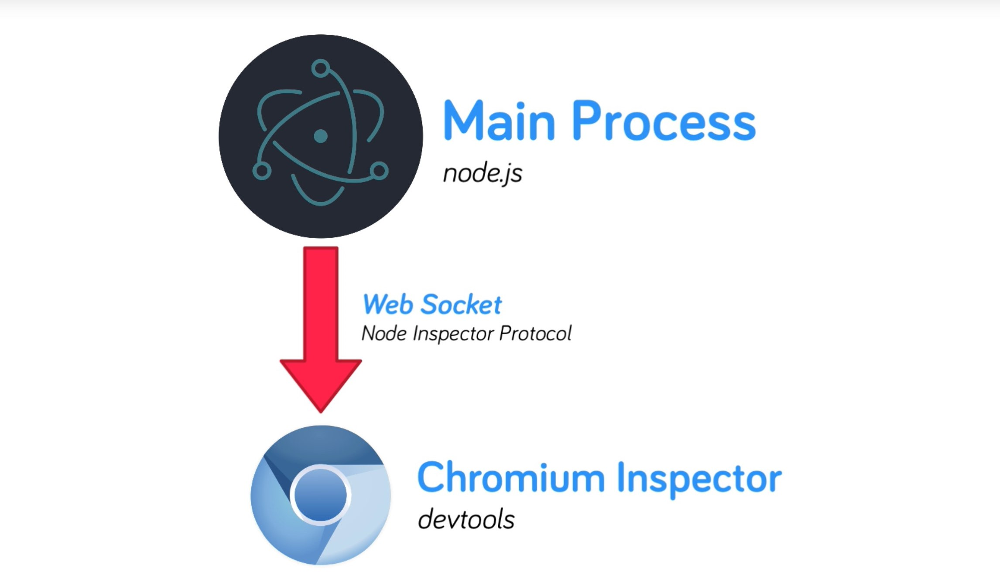
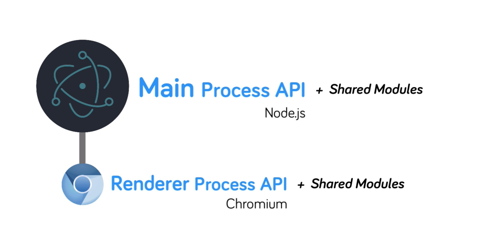
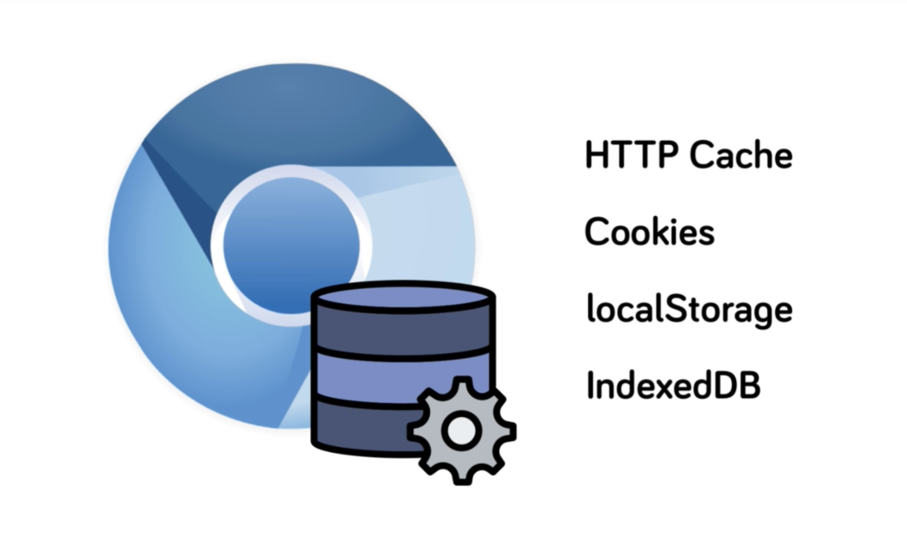
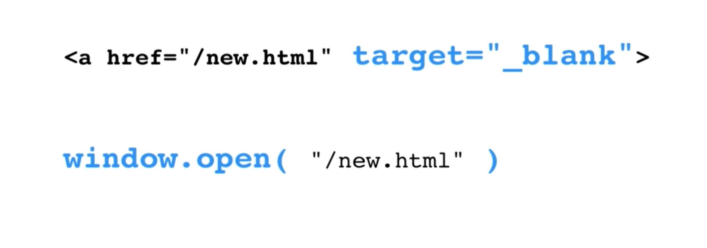

# Electron

## Main Process

- node.js
- Backend or Server-Side 
- 只有一个

### debug

- https://electronjs.org/docs/tutorial/debugging-main-process-vscode

- https://electronjs.org/docs/tutorial/debugging-main-process



## Renderer Process

- chromium
- Front-end or Client-side
- 有几个窗口就有几个
- 由 Main Process 来创建

## Node Native Module

- https://electronjs.org/docs/tutorial/using-native-node-modules

## API



### Main process

#### [app](https://electronjs.org/docs/api/app#app)

- 控制整个应用的生命周期

- Events

  - ready

    ```js
    app.on('ready', () => {
        console.log('App is ready!')
        createWindow() // Create a new BrowserWindow when `app` is ready
    })
    ```
    
    - app.isReady()
    
  - before-quit

    ```js
    app.on('before-quit', () => {
  	    console.log('App is quitting')
    })
    ```
    ```js
    app.on('before-quit', (e) => {
        e.preventDefault()
        storeUserData() // 应用退出之前，保存数据
        app.quit()
    })
    ```
  
  - open-file
  
    - 仅 macOS
    - 用于将文件拖拽到应用上进行打开文件时
  
  - open-url
  
    - 仅 macOS
  
  - browser-window-blur
    
  - browser-window-focus
  
  - ... ...
  
- Methods

  - app.quit()

  - app.exit([exitCode])

  - app.relaunch([options])

  - app.isReady()

  - app.whenReady()

  - app.focus()

  - app.hide()

    - 仅 macOS

  - app.show()

    - 仅 macOS

  - app.getAppPath()

  - **app.getPath(name)**

    ```js
    app.on('ready', () => {
        console.log(app.getPath('desktop'))
        console.log(app.getPath('music'))
        console.log(app.getPath('temp')) // 存储临时数据目录
        console.log(app.getPath('userData')) // 存储应用的用户数据目录，不用担心没有权限或目录不存在
        //...
    })
    ```

  - app.setPath(name, path)
  - app.getVersion()
  - app.getName()
  - app.setName()
  - app.getLocale()
  - ... ...

#### [BrowserWindow](https://electronjs.org/docs/api/browser-window#browserwindow)

- Options

  - width, height
  - minWidth, minHeight
  - resizable
  - movable
  - minimizable
  - maximizable
  - ... ...

- Events

  - focus

    ```js
    mainWindow.on('focus', () => { // 此窗口获得焦点时调用
        console.log('Main win focused')
    })
    
    app.on('browser-window-focus', () => { // 无论哪个窗口获得焦点时都会调用一次
        console.log('App focused')
    })
    ```

  - blur

  - show

  - hide

  - ... ...

- Static methods

  - BrowserWindow.getAllWindows()
  - BrowserWindow.getFocuseWindow()
  - BrowserWindow.fromId(id)
  - ... ...

- Instance Properties

  ```js
  const { BrowserWindow } = require('electron')
  // 在这个例子中,`win` 是我们的实例
  let win = new BrowserWindow({ width: 800, height: 600 })
  win.loadURL('https://github.com')
  ```

  - win.id

  - ... ...

- Instance Methods

  - win.close()
  - win.focus()
  - win.blur()
  - win.isFocus()
  - win.isVisible()
  - win.maximize()
  - win.setFullScreen(flag)
  - win.isFullScreen()
  - win.setBackgroundColor(backgroundColor)
  - ... ...

##### Window State

- https://github.com/mawie81/electron-window-state

##### webContents
- Methods

  - webContents.getAllWebContents()

  - webContents.getFocusedWebContents()

  - webContents.fromId(id)

  ```js
  const {app, BrowserWindow, webContents} = require('electron')
  webContents.getAllWebContents()
  ```

- Instance Events

  - **did-finish-load**

  - did-fail-load

  - did-start-load

  - did-stop-load

  - **dom-ready**

  - **new-window**

  - will-navigate

  - did-start-navigation

  - will-redirect

  - unresponsive

    - 可能正在加载中

  - responsive

  - crashed

    - 此时我们可以 reload webContents

  - before-user-input

  - devtools-opened

  - devtools-closed

  - devtools-focused

  - certificate-error

  - select-client-certificate

  - login

    - basic auth
    - https://developer.mozilla.org/en-US/docs/Web/HTTP/Authentication
    - 如: http://httpbin.org/basic-auth/user/passwd

  - found-in-page

  - media-started-playing

  - media-paused

  - **context-menu**

  - ... ...

  ```js
  const { app, BrowserWindow } = require('electron')
  function createWindow() {
      mainWindow = new BrowserWindow({
          width: 1000,
          height: 800,
          x: 100,
          y: 100,
          webPreferences: { nodeIntegration: true }
      })
      mainWindow.loadFile('index.html')
      // mainWindow.loadFile('http://httpbin.org/basic-auth/user/passwd')
  
      let wc = mainWindow.webContents
  
      wc.on('context-menu', (e, params) => {
          console.log(`Context menu opened on: ${params.mediaType} at x:${params.x}, y:${params.y}`)
          console.log(`User selected text: ${params.selectionText}`)
          console.log(`Selection can be copied: ${params.editFlags.canCopy}`)
          let selectedText = params.selectionText
          wc.executeJavaScript(`alert("${selectedText}")`)
      })
  
      wc.on('media-started-playing', () => {
          console.log('Video Started')
      })
      wc.on('media-paused', () => {
          console.log('Video Paused')
      })
  
      //wc.on('login', (e, request, authInfo, callback) => {
      //  console.log('Logging in:')
      //  callback('user', 'passwd')
      //})
  
      //wc.on('did-navigate', (e, url, statusCode, message) => {
      //  console.log(`Navigated to: ${url}, with response code: ${statusCode}`)
      //  console.log(message)
      //})
  
      wc.on('before-input-event', (e, input) => {
          console.log(`${input.key} : ${input.type}`)
      })
  
      wc.on('new-window', (e, url) => { // 点击链接，默认会弹出新窗口
          e.preventDefault() // 阻止弹出新窗口
          console.log(`Preventing new window for: ${url}`)
          // 可以自己处理 url, 或弹出加载 url 的自定义窗口, 有了更多控制权
      })
  
      wc.on('dom-ready', () => {
          console.log('DOM Ready')
      })
  
      wc.on('did-finish-load', () => {
          console.log('Content fully loaded')
      })
  
      // Listen for window being closed
      mainWindow.on('closed', () => {
          mainWindow = null
      })
  }
  //...
  ```
  
- Instance Methods

  - contents.loadURL(url[, options])
  - contents.loadFile(filePath[, options])
  - contents.dowloadURL(url)
  - contents.focus()
  - contents.reload()
  - contents.goBack()
  - contents.goForward()
  - contents.executeJavaScript(code[, userGesture, callback])
  - contents.undo()
  - contents.redo()
  - contents.cut()
  - contents.copy()
  - ... ...

##### Showing window gracefully

- 首屏加载闪烁问题的解决方案

- Using `ready-to-show` event

  ```js
  const { BrowserWindow } = require('electron')
  
  let win = new BrowserWindow({ show: false })
  win.once('ready-to-show', () => {
      win.show()
  })
  ```
  
- Setting `backgroundColor`

  ```js
  const { BrowserWindow } = require('electron')
  let win = new BrowserWindow({ backgroundColor: '#2e2c29' })
  win.loadURL('https://github.com')
  ```

##### Parent and child windows

  ```js
function createWindow() {

    mainWindow = new BrowserWindow({
        width: 1000,
        height: 800,
        webPreferences: { nodeIntegration: true }
    })

    secondaryWindow = new BrowserWindow({
        width: 600,
        height: 300,
        webPreferences: { nodeIntegration: true },
        parent: mainWindow, // 指定父窗口，只有父窗口存在时，其才能存在，子窗口也会随父窗口移动而移动
        modal: true, // 设为模态窗口
        show: false // 开始不显示窗口
    })

    // Load index.html into the new BrowserWindow
    mainWindow.loadFile('index.html')
    secondaryWindow.loadFile('secondary.html')

    setTimeout(() => {
        secondaryWindow.show() // 显示子窗口
        setTimeout(() => {
            secondaryWindow.close() // 关闭子窗口
            secondaryWindow = null
        }, 3000)
    }, 2000)

    // Open DevTools - Remove for PRODUCTION!
    // mainWindow.webContents.openDevTools();

    // Listen for window being closed
    mainWindow.on('closed', () => {
        mainWindow = null
    })

}
  ```

##### Frameless window

  ```html
<!DOCTYPE html>
<html>
<head>
    <!-- ... -->
</head>
<body style="user-select:none; -webkit-app-region:drag; padding-top:20px;">
    <!-- ... -->
    <input style="-webkit-app-region:no-drag;" type="range" name="range" min="0" max="10">
    <!-- ... -->
</body>
</html>
  ```

  ```js
mainWindow = new BrowserWindow({

    width: 1000,
    height: 800,
    frame: false,
    titleBarStyle: 'hidden',
    webPreferences: { nodeIntegration: true }

})
  ```

#### [session](https://electronjs.org/docs/api/session#session)



```js
const { app, BrowserWindow, session } = require('electron')
//...
function createWindow() {
    //...

    mainWindow = new BrowserWindow({
        width: 1000,
        height: 800,
        webPreferences: { nodeIntegration: true }
    })

    secWindow = new BrowserWindow({
        width: 800,
        height: 600,
        x: 200,
        y: 200,
        webPreferences: { nodeIntegration: true }
    })

    let ses = mainWindow.webContents.session
    let ses2 = secWindow.webContents.session
    console.log(Object.is(ses, ses2)) // true // 默认 session 都是所有窗口共享的

    let defaultSes = session.defaultSession
    console.log(Object.is(ses, defaultSes)) // true

    //...
}

//...
```

```js
const { app, BrowserWindow, session } = require('electron')
//...
function createWindow() {
    //...
    mainWindow = new BrowserWindow({
        width: 1000,
        height: 800,
        webPreferences: { nodeIntegration: true }
    })

    // let customSes = session.fromPartition('part1') // 自定义 session，并不会持久化
    let customSes = session.fromPartition('persist:part1') // 自定义 session，可以持久化

    secWindow = new BrowserWindow({
        width: 800,
        height: 600,
        x: 200,
        y: 200,
        webPreferences: {
            nodeIntegration: true,
            session: customSes // 此窗口使用自定义 session
        }
    })

    let ses = mainWindow.webContents.session
    console.log(Object.is(ses, customSes)) // false
    //...
}
//...
```

```js
const { app, BrowserWindow, session } = require('electron')
//...
function createWindow() {
    //...
    mainWindow = new BrowserWindow({
        width: 1000,
        height: 800,
        webPreferences: { nodeIntegration: true }
    })

    secWindow = new BrowserWindow({
        width: 800,
        height: 600,
        x: 200,
        y: 200,
        webPreferences: {
            nodeIntegration: true,
            partition: 'persist:part1' // 简写, 自定义持久化 session
        }
    })
    //...
}
//...
```

- Instance Methods
  - ses.clearStorageData()
  - ses.clearCache(callback)
  - ses.enableNetworkEmulation(options)
    - 可放慢网络加载，用于开发测试
  - ses.setPermissionRequesHandler(handler)
  - ses.getUserAgent()
  - ses.clearAuthCache(options[, callback])
  - ... ...

#### [cookies](https://electronjs.org/docs/api/cookies#类：cookies)

```js
const { app, BrowserWindow, session } = require('electron')
//...
function createWindow() {
    //...
    let ses = session.defaultSession
    ses.cookies.get({}, (err, cookies) => { // {} 表示获取所有 cookies
        console.log(cookies)
    })

    mainWindow = new BrowserWindow({
        width: 1000,
        height: 800,
        webPreferences: { nodeIntegration: true }
    })
    //...
}
//...
```

```js
const { app, BrowserWindow, session } = require('electron')
//...
function createWindow() {
    //...
    let ses = session.defaultSession
    let getCookies = () => {
        ses.cookies.get({}, (err, cookies) => {
            console.log(cookies)
        })
    }

    mainWindow = new BrowserWindow({
        width: 1000,
        height: 800,
        webPreferences: { nodeIntegration: true }
    })

    mainWindow.loadURL('https://github.com')

    mainWindow.webContents.on('did-finish-load', e => {
        getCookies()
    })
    //...
}
//...
```

```js
const { app, BrowserWindow, session } = require('electron')
//...
function createWindow() {
    //...
    let ses = session.defaultSession
    let getCookies = () => {
        // 只获取特定的 cookie, 过滤 name 为 'cookie1' 的 cookie
        ses.cookies.get({ name: 'cookie1' }, (err, cookies) => {
            console.log(cookies)
        })
    }

    mainWindow = new BrowserWindow({
        width: 1000,
        height: 800,
        webPreferences: { nodeIntegration: true }
    })

    mainWindow.loadFile('index.html')

    let cookie = {
        url: 'https://myappdomain.com',
        name: 'cookie1',
        value: 'electron',
        expirationDate: 1613852855 // 如果需要将此自定义 cookie 持久化，则必须配置
    }

    ses.cookies.set(cookie, err => {
        console.log('cookie1 set')
        getCookies()
    })

    //ses.cookies.remove('https://myappdomain.com', 'cookie1', err => {
    //  getCookies()
    //})

    //...
}

//...
```

- Instance Events
  - changed
  - ... ...
- Instance Methods
  - get
  - set
  - remove
  - ... ...

#### [downloadItem](https://electronjs.org/docs/api/download-item#类：downloaditem)

- Instance Events

  - will-download
  - ... ...

- Instance Methods

  - downloadItem.getFilename()
  - downloadItem.getTotalBytes()
  - downloadItem.getReceivedBytes()
  - downloadItem.setSavePath(path)
  - downloadItem.pause()
  - downloadItem.resume()
  - ... ...

  ```html
  <!DOCTYPE html>
  <html>
  <head>
      <!-- ... -->
  </head>
  <body>
      <!--download 使点击链接直接下载图片，而不是打开图片-->
      <h2><a href="https://picsum.photos/5000/5000/" download>Download Image</a></h2>
      <progress value="0" max="100" id="progress"></progress>
      <script>
      window.progress = document.getElementById('progress')
      </script>
  </body>
  </html>
  ```

  ```js
  const { app, BrowserWindow, session } = require('electron')
  let mainWindow
  
  function createWindow() {
      let ses = session.defaultSession
      mainWindow = new BrowserWindow({
          width: 1000,
          height: 800,
          webPreferences: { nodeIntegration: true }
      })
  
      // Load index.html into the new BrowserWindow
      mainWindow.loadFile('index.html')
  
      ses.on('will-download', (e, downloadItem, webContents) => {
  
          let fileName = downloadItem.getFilename()
          let fileSize = downloadItem.getTotalBytes()
  
          // Save to desktop
          downloadItem.setSavePath(app.getPath('desktop') + `/${fileName}`)
  
          downloadItem.on('updated', (e, state) => {
  
              let received = downloadItem.getReceivedBytes()
  
              if (state === 'progressing' && received) {
                  let progress = Math.round((received / fileSize) * 100)
                  webContents.executeJavaScript(`window.progress.value = ${progress}`)
              }
          })
      })
  
      // Listen for window being closed
      mainWindow.on('closed', () => {
          mainWindow = null
      })
  }
  
  //...
  ```

#### [dialog](https://electronjs.org/docs/api/dialog)

  ```js
function createWindow() {

    mainWindow = new BrowserWindow({
        width: 1000,
        height: 800,
        webPreferences: { nodeIntegration: true }
    })
    mainWindow.loadFile('index.html')
    mainWindow.webContents.on('did-finish-load', () => {
        // 第一个参数 (mainWindow) 为可选参数。 不填，dialog 会是一个独立的窗口。
        // dialog.showOpenDialog(mainWindow, { 
        //   buttonLabel: 'Select a photo',
        //   defaultPath: app.getPath('home'),
        // }, filepaths => {
        //   console.log(filepaths)
        // })

        // dialog.showOpenDialog({
        //   buttonLabel: 'Select a photo',
        //   defaultPath: app.getPath('desktop'),
        //   properties: ['multiSelections', 'createDirectory', 'openFile', 'openDirectory']
        // }, filepaths => {
        //   console.log(filepaths)
        // })

        // dialog.showSaveDialog({}, filename => {
        //   console.log(filename)
        // })

        const answers = ['Yes', 'No', 'Maybe']

        dialog.showMessageBox({
            title: 'Message Box',
            message: 'Please select an option',
            detail: 'Message details.',
            buttons: answers
        }, response => {
            console.log(`User selected: ${answers[response]}`)
        })
    })

    // Listen for window being closed
    mainWindow.on('closed', () => {
        mainWindow = null
    })
}
  ```


#### [accelerator](https://electronjs.org/docs/api/accelerator) & [globalShortcut](https://electronjs.org/docs/api/global-shortcut)

```js
const { app, BrowserWindow, globalShortcut } = require('electron')
let mainWindow

function createWindow() {
    mainWindow = new BrowserWindow({
        width: 1000,
        height: 800,
        webPreferences: { nodeIntegration: true }
    })
    mainWindow.loadFile('index.html')

    // 快捷键，不论窗口是否获得焦点都有效，也可能会与其他应用冲突
    globalShortcut.register('CommandOrControl+G', () => {
        console.log('User pressed G with a combination key')
        globalShortcut.unregister('CommandOrControl+G')
    })

    // Listen for window being closed
    mainWindow.on('closed', () => {
        mainWindow = null
    })
}

//...
```

- Methods
  - globalShortcut.register(accelerator, callback)
  - globalShortcut.isRegister(accelerator)
  - globalShortcut.unregister(accelerator)
  - globalShortcut.unregisterAll()
  - ... ...


#### [Menu](https://electronjs.org/docs/api/menu) & [MenuItem](https://electronjs.org/docs/api/menu-item)

```js
const { app, BrowserWindow, Menu, MenuItem } = require('electron')
let mainWindow

//let mainMenu = new Menu()
//let menuItem1 = new MenuItem({ 
//  label: 'Electron',
//  submenu: [
//    { label: 'Item1' },
//    { label: 'Item2', submenu: [ { label: 'Sub Item 1' } ]}
//  ]
//})
//mainMenu.append(menuItem1)

//let mainMenu = Menu.buildFromTemplate( require('./mainMenu') )

let mainMenu = Menu.buildFromTemplate([
  	{
        label: 'Electron',
        submenu: [
            { label: 'Item1' },
            { label: 'Item2', submenu: [{ label: 'Sub Item 1' }] }
        ]
    },
    {
        label: 'Edit',
        submenu: [
            { role: 'undo' },
            { role: 'redo' },
            { role: 'copy' },
            { role: 'paste' },
        ]
    },
    // { role: 'editMenu' },
    {
        label: 'Actions',
        submenu: [
            { label: 'action 1' },
            {
                label: 'action 2',
                click: () => { console.log('action 2') },
                accelerator: 'Shift+Alt+G' // 快捷键，仅当窗口获得焦点时有效，符合期望
            },
            { label: 'action 3', enabled: false }, // 菜单不可点击
            { label: 'DevTools', role: 'toggleDevTools' }, // 菜单可配置已预定义的功能
            { role: 'toggleFullScreen' }
        ]
    }
])

function createWindow() {
    mainWindow = new BrowserWindow({
        width: 1000,
        height: 800,
        webPreferences: { nodeIntegration: true }
    })
    mainWindow.loadFile('index.html')

    Menu.setApplicationMenu(mainMenu)

    mainWindow.on('closed', () => {
        mainWindow = null
    })
}

//...
```

```js
const { app, BrowserWindow, Menu } = require('electron')
let mainWindow
let contextMenu = Menu.buildFromTemplate([
    { label: 'Item 1' },
    { role: 'editMenu' }
])

function createWindow() {

    //...
    mainWindow.webContents.on('context-menu', e => { // 右键菜单
        contextMenu.popup()
    })

    //...
}

//...
```

#### [Tray](https://electronjs.org/docs/api/tray)

- https://electronjs.org/docs/api/native-image
- https://www.danrodney.com/blog/retina-web-graphics-explained-1x-versus-2x-low-res-versus-hi-res/

```js
const { app, BrowserWindow, Tray } = require('electron')
let mainWindow, tray

let trayMenu = Menu.buildFromTemplate([
    { label: 'Item 1' },
    { role: 'quit' }
])

function createTray() {

    // 一个参数：nativeImage 路径; xxxTemplate 表示系统会根据系统主题或状态来调整其颜色
    tray = new Tray('trayTemplate@2x.png')
    tray.setToolTip('Tray details')

    tray.on('click', e => {
        if (e.shiftKey) { // 如果 shift 键被按下
            app.quit()
        } else {
            mainWindow.isVisible() ? mainWindow.hide() : mainWindow.show()
        }
    })

    tray.setContextMenu(trayMenu) // 配置菜单后，👆click 会被忽略
}

function createWindow() {
    createTray()
    mainWindow.webContents.on('context-menu', e => { // 右键菜单
        contextMenu.popup()
    })

    //...
}

//...
```

- Instance Events
  - click
  - right-click
  - double-click
  - ... ...

#### [powerMonitor](https://electronjs.org/docs/api/power-monitor)

- 监视电源状态
- Events
  - **suspend**
  - **resume**
  - on-ac
    - 仅 Windows
  - on-battery
    - 仅 Windows
  - on-shutdown
    - linux, macOS
  - ... ...

```js
const electron = require('electron')
const { app, BrowserWindow } = electron
let mainWindow

function createWindow() {
    //...
    electron.powerMonitor.on('resume', e => {
        if (!mainWindow) createWindow()
    })

    electron.powerMonitor.on('suspend', e => {
        console.log('Saving some data')
    })
}

//...
```

### Renderer process

#### [remote](https://electronjs.org/docs/api/remote)

- 可以在 Renderer process 中使用 Main process 的任何模块
- 除了 Array 和 Buffer (通过 IPC 和 remote 模块拷贝的)，都是引用自 Main process 的模块

```js
// main.js
const electron = require('electron')
const { app, BrowserWindow } = electron

global['myglob'] = 'A var set in main.js'

let mainWindow

function createWindow() {
    //...
}
//...
```

```js
//renderer.js
const remote = require('electron').remote
const { app, dialog, BrowserWindow } = remote
const button = document.getElementById('test-button')
button.addEventListener('click', e => {
    // dialog.showMessageBox({ message: 'Dialog invoked from Renderer process' })
    // let secWin = new BrowserWindow({
    //   width: 400, height: 350
    // })
    // secWin.loadFile('index.html')
    // console.log( remote.getGlobal('myglob') )
    // app.quit()
    let win = remote.getCurrentWindow()
    win.maximize()
})
```

- Methods
  - remote.require(module)
  - remote.getCurrentWindow()
  - remote.getCurrentWebContents()
  - remote.getGlobal(name)
  - ... ...

#### [BrowserWindowProxy](https://electronjs.org/docs/api/browser-window-proxy)

- 限制功能版的 BrowserWindow 的实例
- window.open(url[, frameName] [, features])
  - frameName, 如: _blank
  - features 为 BrowserWindow 的 options 的字符串形式
- 



```html
<!DOCTYPE html>
<html>
<head>
    <!-- ... -->
</head>
<body>
    <h1>Hello World!</h1>
    <h3><a href="#" onclick="newWin()">New Window</a></h3>
    <h3><a href="#" onclick="closeWin()">Close Window</a></h3>
    <h3><a href="#" onclick="styleWin()">Bad Fonts</a></h3>
    <script>
    let win
    const newWin = () => {
        win = window.open('https://electronjs.org', '_blank', 'width=500,height=450,alwaysOnTop=1')
    }
    const closeWin = () => {
        win.close()
    }
    const styleWin = () => {
        win.eval("document.getElementsByTagName('body')[0].style.fontFamily = 'Comic Sans MS'")
    }
    </script>
</body>
```

#### [webFrame](https://electronjs.org/docs/api/web-frame#webframe)

- 自定义当前网页的渲染

```html
<!DOCTYPE html>
<html>
<head>
    <!-- ... -->
</head>
<body>
    <h1>Hello World!</h1>
    <br>
    <button onclick="zoomUp()">Increase Zoom</button>
    <button onclick="zoomDown()">Decrease Zoom</button>
    <button onclick="zoomReset()">Reset Zoom</button>
    <script>
    const { webFrame } = require('electron')
    const zoomUp = () => {
        // webFrame.setZoomFactor( webFrame.getZoomFactor() + 1 )
        webFrame.setZoomLevel(webFrame.getZoomLevel() + 1)
    }
    const zoomDown = () => {
        // webFrame.setZoomFactor( webFrame.getZoomFactor() - 1 )
        webFrame.setZoomLevel(webFrame.getZoomLevel() - 1)
    }
    const zoomReset = () => {
        // webFrame.setZoomFactor( 1 )
        webFrame.setZoomLevel(1)
    }
    console.log(webFrame.getResourceUsage())
    </script>
</body>

</html>
```

- Methods
  - webFrame.setZoomFactor(factor)
    - 更改缩放比例。缩放比例是缩放百分比除以 100，如 300% = 3.0
  - webFrame.getZoomFactor()
  - webFrame.setZoomLevel(level)
    - 更改缩放等级。 0 = 100%; 1 = 120%, 2 = 140%, ...
  - webFrame.getZoomLevel()
  - webFrame.setSpellCheckProvider(language, autoCorrectWord, provider)
  - webFrame.getResourceUsage()
  - ... ...

#### [desktopCapturer](https://electronjs.org/docs/api/desktop-capturer#desktopcapturer)

- 屏幕截图

- 通过 `navigator.mediaDevices.getUserMedia` API ，可以访问那些用于从桌面上捕获音频和视频的媒体源信息。
- desktopCapturer.getSources(options)
  - options: type
    - window
    - screen
  - options: thumbnailSize
  - ... ...

```html
<!DOCTYPE html>
<html>
<head>
    <!-- ... -->
</head>
<body>
    <h1>Hello World!</h1>
    <br>
    <button id="screenshot-button">Get Screenshot</button>
    <script>
    require('./renderer.js')
    </script>
</body>

</html>
```

```js
// renderer.js
const { desktopCapturer } = require('electron')

document.getElementById('screenshot-button').addEventListener('click', () => {

    desktopCapturer.getSources({ types: ['window'], thumbnailSize: { width: 1920, height: 1080 } }, (error, sources) => {
        console.log(sources)
        document.getElementById('screenshot').src = sources[0].thumbnail.toDataURL()
    })

})
```

### IPC

- remote 模块使用 IPC，使 renderer process 可以访问 main process 的模块

#### [ipcMain](https://electronjs.org/docs/api/ipc-main)

- 从 main process 到 renderer process 的异步通信


#### [ipcRenderer](https://electronjs.org/docs/api/ipc-renderer)

- 从 renderer process 到 main process 的异步通信

#### Asynchronous

```js
//main.js
const { app, BrowserWindow, ipcMain } = require('electron')
// ...
ipcMain.on('channel1', (e, args) => {
    console.log(args)
    e.sender.send('channel1-response', 'Message received on "channel1". Thank you!')
})

//...
```

```js
//renderer.js
const { ipcRenderer } = require('electron')
//...
document.getElementById('talk').addEventListener('click', e => {
    ipcRenderer.send('channel1', 'Hello from main window')
})
ipcRenderer.on('channel1-response', (e, args) => {
    console.log(args)
})
//...
```

```js
//main.js
const { app, BrowserWindow, ipcMain } = require('electron')
//...
function createWindow() {
    //...
    mainWindow.webContents.on('did-finish-load', e => {
        mainWindow.webContents.send('mailbox', {
            from: 'docoder',
            email: 'docoder@163.com',
            priority: 1
        })
    })

    //...
}

//...
```

```js
//renderer.js
//...
ipcRenderer.on('mailbox', (e, args) => {
    console.log(args)
})
//..
```

#### Synchronous

```js
//main.js
const { app, BrowserWindow, ipcMain } = require('electron')
//...
ipcMain.on('sync-message', (e, args) => {
    console.log(args)
    setTimeout(() => {
        e.returnValue = 'A sync response from the main process'
    }, 4000)

})
//....
```

```js
//renderer.js
const { ipcRenderer } = require('electron')
//...
document.getElementById('talk').addEventListener('click', e => {
    let response = ipcRenderer.sendSync('sync-message', 'Waiting for response')
    console.log(response)
})
//...
```

### Shares Modules

#### [process](https://electronjs.org/docs/api/process)

- Property

  - process.versions
    - node
    - chrome
    - electron
    - ... ...
  - process.type
  - process.windowsStore
    - 是否从 Windows Store 安装
  - process.mas
    - 是否从 Mac App Store 安装
  - ... ...

- Methods

  - process.getCreationTime()
  - process.getCPUUsage()
  - process.getSystemMemoryInfo()
  - process.crash()
  - process.hang()
  - ... ...

  ```html
  <!DOCTYPE html>
  <html>
  <head>
      <!-- ... -->
  </head>
  <body>
      <!-- ... -->
      <br><button type="button" onclick="process.hang()">Hang Renderer</button>
      <br><button type="button" onclick="process.crash()">Crash Renderer</button>
      <!-- ... -->
  </body>
  </html>
  ```

  ```js
  const { app, BrowserWindow } = require('electron')
  let mainWindow
  
  function createWindow() {
      //...
      mainWindow.webContents.on('crashed', mainWindow.reload)
      //...
  }
  //...
  ```

#### [screen](https://electronjs.org/docs/api/screen#screen)

- Event
  - display-added
  - display-removed
  - display-metrics-changed

- Methods
  - screen.getCursorScreenPoint()
  - screen.getPrimaryDisplay()
  - screen.getAllDisplays()
  - ... ...

```js
// renderer.js
const electron = require('electron')
const displays = electron.screen.getAllDisplays()

//第一个显示器（主显示器）
console.log(`${displays[0].size.width} x ${displays[0].size.height}`)
console.log(`${displays[0].bounds.x}, ${displays[0].bounds.y}`) // 0, 0
//第二个显示器（扩展显示器）
console.log(`${displays[1].size.width} x ${displays[1].size.height}`)
console.log(`${displays[1].bounds.x}, ${displays[1].bounds.y}`) // 相对于主显示器排列的坐标

// 显示器排列改变的事件
electron.screen.on('display-metrics-changed', (e, display, metricsChanged) => {
    console.log(metricsChanged)
})

document.getElementsByTagName('body')[0].addEventListener('click', e => {
    console.log(electron.screen.getCursorScreenPoint())
})
```

```js
// main.js
const electron = require('electron')
const { app, BrowserWindow } = electron
let mainWindow

function createWindow() {
    let primaryDisplay = electron.screen.getPrimaryDisplay()
    mainWindow = new BrowserWindow({
        x: primaryDisplay.bounds.x,
        y: primaryDisplay.bounds.y,
        width: primaryDisplay.size.width / 2,
        height: primaryDisplay.size.height,
        webPreferences: { nodeIntegration: true }
    })
    //...
}
//...
```

#### [shell](https://electronjs.org/docs/api/shell#shell)

- Methods
  - shell.showItemInFolder(fullPath)
  - shell.openItem(fullPath)
  - shell.openExternal(url[, options, callback])
  - shell.moveItemToTrash(fullPath)
  - ... ...

```html
<!DOCTYPE html>
<html>
<head>
    <!-- ... -->
</head>
<body>
    <!-- ... -->
    <button onclick="showSite()">Launch Electron.js Site</button><br>
    <button onclick="openSplash()">Open Splash.png</button><br>
    <button onclick="showSplashFile()">Show Splash.png</button><br>
    <button onclick="deleteSplashFile()">Delete Splash.png</button><br>
    <script>
    const { shell } = require('electron')
    const showSite = e => {
        shell.openExternal('https://electronjs.org')
    }
    const splashPath = `${__dirname}/splash.png`
    const openSplash = e => {
        shell.openItem(splashPath)
    }
    const showSplashFile = e => {
        shell.showItemInFolder(splashPath)
    }
    const deleteSplashFile = e => {
        shell.moveItemToTrash(splashPath)
    }
    </script>
</body>
</html>
```

#### [nativeImage](https://electronjs.org/docs/api/native-image#nativeimage)

- Instance Methods
  - image.toPNG([options])
  - image.toJPEG(quality)
  - image.toBitmap([options])
  - image.toDataURL([options])
    - https://developer.mozilla.org/en-US/docs/Web/HTTP/Basics_of_HTTP/Data_URIs
  - image.getBitmap([options])
  - ... ...

```html
<!DOCTYPE html>
<html>
<head>
    <!-- ... -->
</head>
<body>
    <h1>Convert splash.png:</h1>
    <button onclick="toPng()">PNG</button>
    <button onclick="toJpg()">JPG</button>
    <button onclick="toTag()">Show</button>
    <br>
    <script>
    const fs = require('fs')
    const { nativeImage, remote } = require('electron')
    const splash = nativeImage.createFromPath(`${__dirname}/splash.png`)
    const saveToDesktop = (data, ext) => {
        let desktopPath = remote.app.getPath('desktop')
        fs.writeFile(`${desktopPath}/splash.${ext}`, data, console.log)
    }
    const toTag = e => {
        let size = splash.getSize()
        let splashURL = splash.resize({ width: size.width / 4, height: size.height / 4 }).toDataURL()
        document.getElementById('preview').src = splashURL
    }
    const toPng = e => {
        let pngSplash = splash.toPNG()
        saveToDesktop(pngSplash, 'png')
    }
    const toJpg = e => {
        let jpgSplash = splash.toJPEG(100)
        saveToDesktop(jpgSplash, 'jpg')
    }
    </script>
</body>
</html>
```

#### [clipboard](https://electronjs.org/docs/api/clipboard)

- Methods
  - clipboard.readText([type])
  - clipboard.writeText(text[, type])
  - clipboard.readHTML([type])
  - clipboard.writeHTML(markup[, type])
  - clipboard.readImage([type])
  - clipboard.writeImage(image[, type])
  - ... ...

```html
<!DOCTYPE html>
<html>
<head>
    <!-- ... -->
</head>
<body>
    <!-- ... -->
    <br><button onclick="makeUpper()">Make clipboard uppercase</button>
    <br><button onclick="showImage()">Show clipboard image</button>
    <br>
    <script>
    const { clipboard } = require('electron')
    console.log(clipboard.readText())
    const showImage = e => {
        let image = clipboard.readImage()
        document.getElementById('cbImage').src = image.toDataURL()
    }
    const makeUpper = e => {
        let cbText = clipboard.readText()
        clipboard.writeText(cbText.toUpperCase())
    }
    </script>
</body>
</html>
```

### Features & Techniques

#### [offscreen rendering](https://electronjs.org/docs/tutorial/offscreen-rendering)

- GPU, 默认
- only CPU
- render animation, 尤其，3d css animation, 用 GPU, 否则用 CPU 会更快

```js
const { app, BrowserWindow } = require('electron')
const fs = require('fs')
let mainWindow

app.disableHardwareAcceleration() // 改为 CPU

function createWindow() {

    mainWindow = new BrowserWindow({
        width: 1000,
        height: 800,
        show: false,
        webPreferences: {
            nodeIntegration: true,
            offscreen: true
        }
    })

    mainWindow.loadURL('https://electronjs.org')

    let i = 1
    mainWindow.webContents.on('paint', (e, dirty, image) => {
        let screenshot = image.toPNG()
        fs.writeFile(app.getPath('desktop') + `/screenshot_${i}.png`, screenshot, console.log)
        i++
    })

    mainWindow.webContents.on('did-finish-load', e => {
        console.log(mainWindow.getTitle())
        mainWindow.close()
        mainWindow = null
    })

    //...
}

//...
```

#### network detection

- https://developer.mozilla.org/en-US/docs/Web/API/NavigatorOnLine/onLine
- https://developer.mozilla.org/en-US/docs/Web/API/NavigatorOnLine/Online_and_offline_events

```html
<!DOCTYPE html>
<html>
<head>
    <!-- ... -->
</head>
<body>
    <h1>App is: <u id="status"></u></h1>
    <script>
    const setStatus = status => {
        const statusNode = document.getElementById('status')
        statusNode.innerText = status ? 'online' : 'offline'
    }
    setStatus(navigator.onLine)
    window.addEventListener('online', e => {
        setStatus(true)
    })
    window.addEventListener('offline', e => {
        setStatus(false)
    })
    </script>
</body>
</html>
```

#### [notifications](https://electronjs.org/docs/tutorial/notifications)

- https://developer.mozilla.org/en-US/docs/Web/API/notification
- https://pushjs.org/
- https://github.com/web-push-libs/web-push
- https://developers.google.com/web/fundamentals/codelabs/push-notifications/

```js
// renderer.js
const { remote } = require('electron')
const self = remote.getCurrentWindow()
setTimeout(() => {
    let notification = new Notification('Electron App', {
        body: 'Some notification info!'
    })
    notification.onclick = e => {
        if (!self.isVisible()) self.show()
    }
}, 2000)
```

#### preload script

- https://electronjs.org/docs/tutorial/security
- nodeIntegration: true
  - 在使用 remote content 时有安全隐患，因为其可以通过 nodejs 访问用户电脑系统
    - 如 mainWindow.loadURL('https://github.com')
  - 在使用静态内容时则没有安全隐患
    - 如 mainWindow.loadFile('index.html')

```js
// main.js
const { app, BrowserWindow } = require('electron')
let mainWindow

function createWindow() {
    mainWindow = new BrowserWindow({
        width: 1000,
        height: 800,
        webPreferences: {
            nodeIntegration: false, // 将 nodeIntegration 置为 false
            contextIsolation: false, // 使 preload.js 可以访问 windows context
            preload: __dirname + '/preload.js' // 使用预加载 js 脚本
        }
    })
    mainWindow.loadURL('https://github.com')

    //...
}

//...
```

```js
// preload.js

const { remote } = require('electron')
const fs = require('fs')

const desktopPath = remote.app.getPath('desktop')

window.writeToFile = text => {
    fs.writeFile(desktopPath + '/app.txt', text, console.log)
}

window.versions = {
    node: process.versions.node,
    electron: process.versions.electron
}
```

```html
<!DOCTYPE html>
<html>
<head>
    <!-- ... -->
</head>
<body>
    <!-- ... -->
    We are using Node.js <strong>
        <script>
        document.write(versions.node)
        </script>
    </strong>,
    and Electron <strong>
        <script>
        document.write(versions.electron)
        </script>
    </strong>.
    <br><textarea id="content" rows="8" cols="80"></textarea>
    <br><button id="save" onclick="saveText()">Save Content</button>
    <script>
    const saveText = e => {
        const text = document.getElementById('content').value
        writeToFile(text)
    }
    </script>
</body>
</html>
```

#### [progress bar](https://electronjs.org/docs/tutorial/progress-bar)

- win.setProgressBar(progress[, options])

```js
// renderer.js
const { remote } = require('electron')
const self = remote.getCurrentWindow()
let progress = 0.01
let progressInterval = setInterval(() => {

    self.setProgressBar(progress)

    if (progress <= 1) {
        progress += 0.01
    } else {
        self.setProgressBar(-1)
        clearInterval(progressInterval)
    }
}, 75)
```

## Electron & React

### Init & Install

```bash
# create-react-app
npx create-react-app my-app

# router
yarn add react-router-dom

# electron
yarn add electron electron-builder --dev

# reload
yarn add electron-reload nodemon --dev

# helper
yarn add electron-is-dev
yarn add cross-env concurrently wait-on --dev
```

### package.json

```json
{
  "name": "version",
  "version": "0.1.0",
  "private": true,
  "homepage": "./",
  "main": "src/_electron/index.js",
  "dependencies": {
    "electron-is-dev": "^1.1.0",
    "react": "^16.12.0",
    "react-dom": "^16.12.0",
    "react-router-dom": "^5.1.2",
    "react-scripts": "3.2.0"
  },
  "scripts": {
    "start": "react-scripts start",
    "build": "react-scripts build",
    "test": "react-scripts test",
    "eject": "react-scripts eject",
    "electron": "cross-env NODE_ENV=dev nodemon --exec \"\"electron .\"\"",
    "dev": "concurrently \"cross-env BROWSER=none yarn start\" \"wait-on http://localhost:3000 && yarn run electron\""
  },
  "eslintConfig": {
    "extends": "react-app"
  },
  "browserslist": "Chrome 78",
  "devDependencies": {
    "concurrently": "^5.0.0",
    "cross-env": "^6.0.3",
    "electron": "^7.1.2",
    "electron-builder": "^21.2.0",
    "electron-reload": "^1.5.0",
    "nodemon": "^2.0.1",
    "wait-on": "^3.3.0"
  }
}
```

### 多页面模拟

```js
// src/_electron/index.js
const electron = require("electron");
const app = electron.app;
const path = require("path");
const isDev = require("electron-is-dev");
require('electron-reload')
const BrowserWindow = electron.BrowserWindow;

let mainWindow;

function createWindow() {
    //...
    mainWindow.loadURL(
        isDev ?
        "http://localhost:3000?Page1" // Page1页面
        :
        `file://${path.join(__dirname, "../build/index.html?Page1")}` // Page1页面
    );
    //...
}
//...
```

```jsx
// src/pages/index.js

import React from "react"
import { BrowserRouter as Router, Route } from "react-router-dom"
import Page1 from "./Page1"
import Page2 from "./Page2"

function Pages() {
    const pages = () => {
        return {
            Page1: <Page1 />,
      Page2: <Page2 />
        };
    };
    const page = props => {
        let name = props.location.search.substr(1)
        let page = pages()[name]
        if (!page) throw new Error(`Page: ${name} no exits!`)
        return page;
    };
    return (
        <Router>
            <div>
                <Route path="/" component={page} />
            </div>
        </Router>
    );
}

export default Pages
```

```jsx
// src/index.js
import React from 'react';
import ReactDOM from 'react-dom';
import './index.css';
import App from './pages';

ReactDOM.render(<App />, document.getElementById('root'))
```

