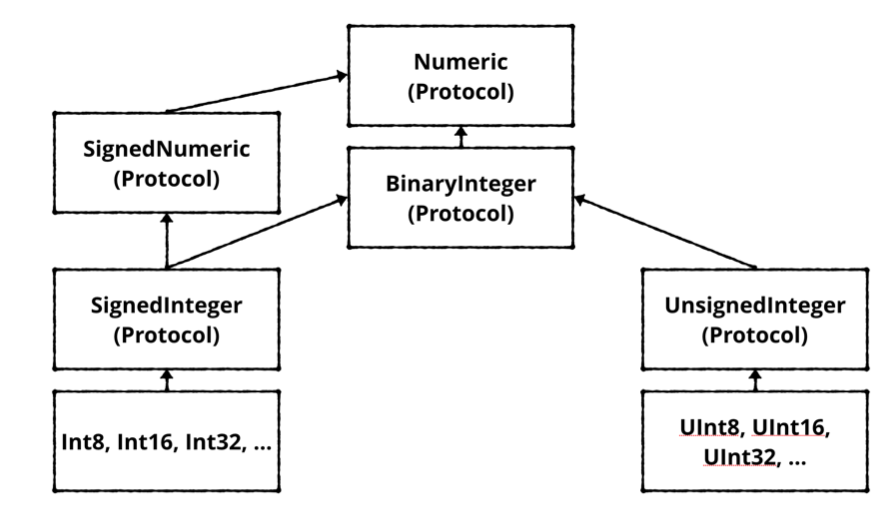
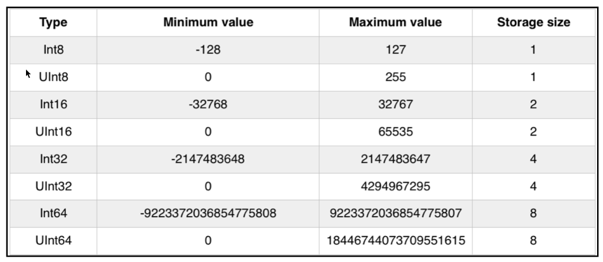
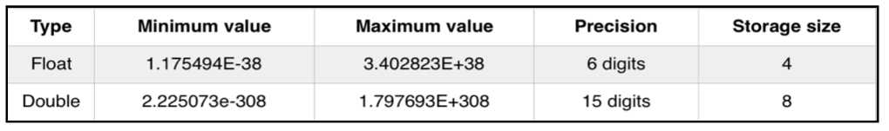
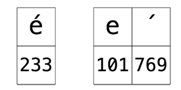
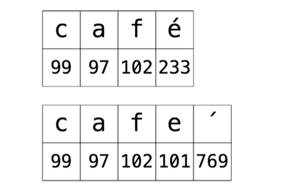

## 基本

### 注释

```swift
// This is a comment. It is not executed.
```

```swift
/* 
This is also a comment.
Over many..
many...
many lines. 
*/
```

####嵌套注释

```swift
/* This is a comment.
/* 
And inside it is another comment. 
*/
Back to the first. 
*/
```

### 后台打印

```swift
print("Hello, Swift Apprentice reader!") // 默认换行
print("\(player), ", terminator: "") // 指定 terminator 为 "", 不换行
```

### Math functions

```swift
sin(45 * Double.pi / 180) // 0.7071067811865475
cos(135 * Double.pi / 180) // -0.7071067811865475
(2.0).squareRoot() // 1.414213562373095
max(5, 10) // 10
min(-5, -10) // -10
```

### 常量

```swift
let pi: Double = 3.14159
```

### 变量

```swift
var variableNumber: Int = 42
variableNumber = 0
variableNumber += 1
variableNumber /= 1
variableNumber = 1_000_000
var 🐶 💩 : Int = -1 // You can even use the full range of Unicode characters
```

### 类型转换

```swift
var integer: Int = 100
var decimal: Double = 12.5
integer = Int(decimal)

let hourlyRate = 19.5
let hoursWorked = 10
let totalCost = hourlyRate * Double(hoursWorked)
```

### 类型推导

```swift
let typeInferredInt = 42
let typeInferredDouble = 3.14159
let actuallyDouble = Double(3) // 使用类型转换
let actuallyDouble: Double = 3 // 阻止使用类型推导
let actuallyDouble = 3 as Double // 使用 as 做类型转换
let wantADouble = 3.0
```

### Integer







### Boolean

```swift
let yes: Bool = true 
let no: Bool = false
let doesOneEqualTwo = (1 == 2)
let doesOneNotEqualTwo = (1 != 2)
let alsoTrue = !(1 == 2)
let isOneGreaterThanTwo = (1 > 2) 
let isOneLessThanTwo = (1 < 2)
let and = true && true // 短路
let or = true || false // 短路
let andOr = (1 < 2 && 3 > 4) || 1 < 4
let guess = "dog" 
let dogEqualsCat = guess == "cat"
let order = "cat" < "dog" // 按字母表顺序
```

```swift
var switchState = true 
switchState.toggle() // switchState = false 
switchState.toggle() // switchState = true
```

### String

```swift
let characterA: Character = "a"
let characterDog: Character = "🐶 "
let stringDog: String = "Dog"
let stringDog = "a" // 类型推导为 String, Swift 中不会推导为 Character
```

```swift
var message = "Hello" + " my name is " 
let name = "Matt" 
message += name // "Hello my name is Matt"
let exclamationMark: Character = "!"
message += String(exclamationMark) // "Hello my name is Matt!"
```

####插入

```swift
message = "Hello my name is \(name)!" // "Hello my name is Matt!"
let oneThird = 1.0 / 3.0 
let oneThirdLongString = "One third is \(oneThird) as a decimal."
//One third is 0.3333333333333333 as a decimal.
```

####多行

```swift
let bigString = """ 
  You can have a string 
  that contains multiple 
    lines 
    by 
  doing this.
  """
print(bigString)
/*
You can have a string 
that contains multiple 
	lines 
	by 
doing this.
*/
// 会以末尾的 """ 的位置为基线去掉了每行开头的空格
```

####[String as Collection](#String as Collection)

#### Encoding

```swift
let characters = "+\u{00bd}\u{21e8}\u{1f643}" // +½⇨🙃
for i in characters.utf8 { 
  print("\(i) : \(String(i, radix: 2))") 
}
// 43 : 101011
//
// 194 : 11000010 
// 189 : 10111101
//
// 226 : 11100010 
// 135 : 10000111 
// 168 : 10101000
//
// 240 : 11110000 
// 159 : 10011111 
// 153 : 10011001 
// 131 : 10000011
for i in characters.utf16 { 
  print("\(i) : \(String(i, radix: 2))") 
}
// 43 : 101011
//
// 189 : 10111101
//
// 8680 : 10000111101000
//
// 55357 : 1101100000111101
// 56899 : 1101111001000011
```

####Converting [indexes](#Indexing Strings) between encoding views

```swift
let arrowIndex = characters.index(of: "\u{21e8}")! 
characters[arrowIndex] // ⇨

// unicodeScalarsIndex 为 String.UnicodeScalarView.Index 类型
if let unicodeScalarsIndex = arrowIndex.samePosition(in: characters.unicodeScalars) {
  characters.unicodeScalars[unicodeScalarsIndex] // 8680 
} 
// utf8Index 为 String.UTF8View.Index 类型
if let utf8Index = arrowIndex.samePosition(in: characters.utf8) {
  characters.utf8[utf8Index] // 226
} 
// utf16Index 为 String.UTF16View.Index 类型
if let utf16Index = arrowIndex.samePosition(in: characters.utf16) {
  characters.utf16[utf16Index] // 8680 
}
```

### 元组

```swift
let coordinates: (Int, Int) = (2, 3)
let coordinatesInts = (2, 3) // Inferred to be of type (Int, Int)
let coordinatesDoubles = (2.1, 3.5) // Inferred to be of type (Double, Double)
let coordinatesMixed = (2.1, 3) // Inferred to be of type (Double, Int)
let x1 = coordinates.0 
let y1 = coordinates.1

let coordinatesNamed = (x: 2, y: 3) // Inferred to be of type (x: Int, y: Int)
let x2 = coordinatesNamed.x
let y2 = coordinatesNamed.y

let coordinates3D = (x: 2, y: 3, z: 1) 
let (x3, y3, z3) = coordinates3D
//等价于
let coordinates3D = (x: 2, y: 3, z: 1) 
let x3 = coordinates3D.x 
let y3 = coordinates3D.y 
let z3 = coordinates3D.z

let (x4, y4, _) = coordinates3D // _ 表示忽视此部分的值
```

### Countable ranges

#### closed range

```swift
let closedRange = 0...5 //(0, 1, 2, 3, 4, 5)
```

#### half-open range

```swift
let halfOpenRange = 0..<5 //(0, 1, 2, 3, 4)
```

#### open-ended range

确定一个 index, 另一个为 [Collection](#Collections) 的开始或结尾

```swift
let fullName = "Matt Naff" 
let spaceIndex = fullName.index(of: " ")!
let firstName = fullName[..<spaceIndex] // "Matt"
```

### 条件

####if

```swift
let hourOfDay = 12 
var timeOfDay = ""
if hourOfDay < 6 { 
  timeOfDay = "Early morning" 
} else if hourOfDay < 12 {
  timeOfDay = "Morning" 
} else if hourOfDay < 17 {
  timeOfDay = "Afternoon" 
} else if hourOfDay < 20 {
  timeOfDay = "Evening" 
} else if hourOfDay < 24 {
  timeOfDay = "Late evening" 
} else {
  timeOfDay = "INVALID HOUR!" 
} 
print(timeOfDay)

let a = 5 let b = 10
let min = a < b ? a : b let max = a > b ? a : b
```

####switch

```swift
let number = 10
switch number { 
case 0:
  print("Zero") 
default:
  print("Non-zero") 
}

let string = "Dog"
switch string { 
case "Cat", "Dog":
  print("Animal is a house pet.") 
default:
  print("Animal is not a house pet.") 
}
```

```swift
let hourOfDay = 12
var timeOfDay = ""
switch hourOfDay { 
case 0, 1, 2, 3, 4, 5:
  timeOfDay = "Early morning" 
case 6, 7, 8, 9, 10, 11:
  timeOfDay = "Morning" 
case 12, 13, 14, 15, 16:
  timeOfDay = "Afternoon" 
case 17, 18, 19:
  timeOfDay = "Evening" 
case 20, 21, 22, 23:
  timeOfDay = "Late evening" 
default:
  timeOfDay = "INVALID HOUR!" 
}
// 等价于
switch hourOfDay { 
case 0...5:
  timeOfDay = "Early morning" 
case 6...11:
  timeOfDay = "Morning"
case 12...16:
  timeOfDay = "Afternoon" 
case 17...19:
  timeOfDay = "Evening" 
case 20..<24:
  timeOfDay = "Late evening" 
default:
  timeOfDay = "INVALID HOUR!" 
}
print(timeOfDay)
```

```swift
switch number { 
case let x where x % 2 == 0:
  print("Even") 
default:
  print("Odd") 
}
//等价于
switch number { 
case _ where number % 2 == 0:
  print("Even") 
default:
  print("Odd") 
}
```

##### partial matching

```swift
let coordinates = (x: 3, y: 2, z: 5)
switch coordinates { 
case (0, 0, 0): // 1
  print("Origin") 
case (_, 0, 0): // 2
  print("On the x-axis.") 
case (0, _, 0): // 3
  print("On the y-axis.") 
case (0, 0, _): // 4
  print("On the z-axis.") 
default: // 5
  print("Somewhere in space") 
}
```

```swift
switch coordinates { 
case (0, 0, 0):
  print("Origin") 
case (let x, 0, 0):
  print("On the x-axis at x = \(x)") 
case (0, let y, 0):
  print("On the y-axis at y = \(y)") 
case (0, 0, let z):
  print("On the z-axis at z = \(z)") 
case let (x, y, z):
  print("Somewhere in space at x = \(x), y = \(y), z = \(z)") 
}
```

```swift
switch coordinates { 
case let (x, y, _) where y == x:
  print("Along the y = x line.") 
case let (x, y, _) where y == x * x:
  print("Along the y = x^2 line.") 
default:
  break 
}
```

### 循环

#### while

```swift
while <CONDITION> { 
  <LOOP CODE> 
}

var sum = 1
while sum < 1000 { 
  sum = sum + (sum + 1) 
}
sum = 1
while true { 
  sum = sum + (sum + 1) 
  if sum >= 1000 { 
    break 
  } 
}
```

```swift
while Int.random(in: 1...6) != 6 { 
  print("Not a six") 
}
```

#### repeat

```swift
repeat { 
  <LOOP CODE> 
} while <CONDITION>

var sum = 1
repeat { 
  sum = sum + (sum + 1) 
} while sum < 1000
```

#### for

```swift
for <CONSTANT> in <COUNTABLE RANGE> { 
  <LOOP CODE> 
}

let count = 3 
var sum = 0 
for i in 1...count { 
  sum += i 
}
// 6

sum = 1 var lastSum = 0
for _ in 0..<count { // 用 _ 忽视 index
  let temp = sum
  sum = sum + lastSum 
  lastSum = temp
}

sum = 0 
for i in 1...count where i % 2 == 1 { // 遍历 1 to count, 仅当 where 为 true 时执行循环体
  sum += i 
}

sum = 0
for row in 0..<8 {
  if row % 2 == 0 { 
    continue 
  }
  for column in 0..<8 { 
    sum += row * column 
  }
}

// labeled statements
sum = 0
rowLoop: for row in 0..<8 {
  columnLoop: for column in 0..<8 { 
    if row == column { 
      continue rowLoop 
    } 
    sum += row * column 
  } 
}
```

## Function

### 基本

####参数

```swift
func printMyName() { 
  print("My name is Matt.") 
}
printMyName()

func printMultipleOf(multiplier: Int, andValue: Int) { 
  print("\(multiplier) * \(andValue) = \(multiplier * andValue)") 
} 
printMultipleOf(multiplier: 4, andValue: 2)

// 使 external parameter name (方法调用的名字) (and)与方法里使用的名字(value)不同，更语义化
func printMultipleOf(multiplier: Int, and value: Int) {
  print("\(multiplier) * \(value) = \(multiplier * value)") 
} 
printMultipleOf(multiplier: 4, and: 2)

// 用 _ 忽略 external parameter name，更语义化
func printMultipleOf(_ multiplier: Int, and value: Int) { 
  print("\(multiplier) * \(value) = \(multiplier * value)") 
} 
printMultipleOf(4, and: 2)

// 默认参数
func printMultipleOf(_ multiplier: Int, _ value: Int = 1) { 
  print("\(multiplier) * \(value) = \(multiplier * value)") 
} 
printMultipleOf(4)
```

##### pass-by-value

```swift
// Error: 参数为常量不能修改
func incrementAndPrint(_ value: Int) { 
  value += 1 
  print(value) 
}
// Error: Left side of mutating operator isn't mutable: 'value' is a 'let' constant
```

##### copy-in copy-out

```swift
func incrementAndPrint(_ value: inout Int) { 
  value += 1 
  print(value)
}
var value = 5 
incrementAndPrint(&value) 
print(value) // 6
```

##### pass-by-reference

有时编译器会把 copy-in copy-out 优化为 pass-by-reference, 而不进行 copy 的操作


#### return

```swift
func multiply(_ number: Int, by multiplier: Int) -> Int { 
  return number * multiplier 
} 
let result = multiply(4, by: 2)

// 元组
func multiplyAndDivide(_ number: Int, by factor: Int) -> (product: Int, quotient: Int) { 
  return (number * factor, number / factor) 
} 
let results = multiplyAndDivide(4, by: 2) 
let product = results.product 
let quotient = results.quotient
```

##### Never

```swift
func noReturn() -> Never {

} // error: Function with uninhabited return type 'Never' is missing call to another never-returning function on all paths
// Never 表示函数不会返回。
// 上面👆的函数会执行到函数结束会返回，这与 Never 冲突，故报错。
// 于是下面👇的函数就符合 Never 的返回类型
func infiniteLoop() -> Never { 
  while true { } 
}
```

#### 重载

- 不同的参数个数

- 不同的参数类型

- 不同的 external parameter names

- 不同的返回类型

  ```swift
  func getValue() -> Int { return 31 }
  func getValue() -> String { return "Matt" }
  
  let value = getValue() // error: ambiguous use of 'getValue()'
  
  // Fix
  let valueInt: Int = getValue() 
  let valueString: String = getValue()
  ```

### Function 作为变量

```swift
func add(_ a: Int, _ b: Int) -> Int { 
  return a + b 
}
func subtract(_ a: Int, _ b: Int) -> Int { 
  return a - b 
}

func printResult(_ function: (Int, Int) -> Int, _ a: Int, _ b: Int) { 
  let result = function(a, b) 
  print(result) 
} 
printResult(add, 4, 2)
```

### Closure

没有名字的函数

#### 基本

```swift
var multiplyClosure: (Int, Int) -> Int
```

```swift
var multiplyClosure = { (a: Int, b: Int) -> Int in 
	return a * b 
}
let result = multiplyClosure(4, 2)
```

#### 简写

```swift
var multiplyClosure: (Int, Int) -> Int
//可以省掉return
multiplyClosure = { (a: Int, b: Int) -> Int in
  a*b 
}
//可以省掉返回类型
multiplyClosure = { (a: Int, b: Int) in
  a*b 
}
//可以省掉参数类型
multiplyClosure = { (a, b) in
  a*b 
}
//可以省掉参数列表
multiplyClosure = {
  $0 * $1 
}
```

```swift
func operateOnNumbers(a: Int, _ b: Int, operation: (Int, Int) -> Int) -> Int {
  let result = operation(a, b)
  print(result)
  return result
}
//使用 Closure
//step 1
let addClosure = { (a: Int, b: Int) in
  a + b 
}
operateOnNumbers(4, 2, operation: addClosure)

//等价于, 使用普通函数
func addFunction(a: Int, b: Int) -> Int {
  return a + b 
}
operateOnNumbers(4, 2, operation: addFunction)

//step 2
operateOnNumbers(4, 2, operation: { (a: Int, b: Int) -> Int in
  a + b 
})

//step 3
operateOnNumbers(4, 2, operation: {
  $0 + $1 
})

//step 4
operateOnNumbers(4, 2, operation: +)

//当 closure 为最后一个参数时, 使用 trailing closure syntax, 可简写为：
operateOnNumbers(4, 2) {
  $0 + $1 
}
```

#### 无返回值

```swift
let voidClosure: () -> Void = { // 返回值类型的 Void 实际上是 () 的别称, 但参数的 () 不能用 Void
  print("Swift is awesome!") 
} 
voidClosure()
```

#### 闭包

```swift
func countingClosure() -> (() -> Int) {
  var counter = 0
  let incrementCounter: () -> Int = {
    counter += 1
    return counter
  }
  return incrementCounter
}

let counter1 = countingClosure()
let counter2 = countingClosure()

counter1() // 1
counter2() // 1
counter1() // 2
counter1() // 3
counter2() // 2
```

## Optionals

Swift 对于有值和无值的解决方案。一个 optional 要么包含一个值要么包含 nil，但这个 optional 是存在的

```swift
var errorCode: Int? // 用 ? 声明一个 optional 类型的变量
errorCode = 100
errorCode = nil
```

```swift
var result: Int? = 30 
print(result) // warning: Expression implicitly coerced from 'Int?' to Any
// Optional(30) 
print(result as Any) // To silence the warning
print(result + 1) // error: Value of optional type 'Int?' must be unwrapped to a value of type 'Int'
```

### Force unwrapping

```swift
var authorName: String? = "Matt" 
var authorAge: Int? = 30

var unwrappedAuthorName = authorName! // 使用 ! 强制解包
print("Author is \(unwrappedAuthorName)")

authorName = nil 
print("Author is \(authorName!)") // Fatal error: Unexpectedly found nil while unwrapping an Optional value

if authorName != nil { 
  print("Author is \(authorName!)")
} else { 
  print("No author.") 
}
```

### Optional binding

```swift
if let unwrappedAuthorName = authorName {
  print("Author is \(unwrappedAuthorName)") 
} else {
  print("No author.") 
}

if let authorName = authorName, let authorAge = authorAge { 
  print("The author is \(authorName) who is \(authorAge) years old.") 
} else {
  print("No author or no age.") 
}

if let authorName = authorName, let authorAge = authorAge, authorAge >= 40 { 
  print("The author is \(authorName) who is \(authorAge) years old.") 
} else { 
  print("No author or no age or age less than 40.") 
}
```

### guard

```swift
func calculateNumberOfSides(shape: String) -> Int? { // 返回可选类型
  switch shape {
  case "Triangle":
    return 3 
  case "Square":
    return 4 
  case "Rectangle":
    return 4 
  case "Pentagon":
    return 5 
  case "Hexagon":
    return 6 
  default:
    return nil 
  }
}

func maybePrintSides(shape: String) { 
  let sides = calculateNumberOfSides(shape: shape)
  if let sides = sides {
    print("A \(shape) has \(sides) sides.")    
  } else {
    print("I don't know the number of sides for \(shape).") 
  }
}
// 等价于
func maybePrintSides(shape: String) {
  guard let sides = calculateNumberOfSides(shape: shape) else { //guard
    print("I don't know the number of sides for \(shape).") 
    return 
  }
  print("A \(shape) has \(sides) sides.")
}
```

### Nil coalescing

```swift
var optionalInt: Int? = 10 
var mustHaveResult = optionalInt ?? 0 // ?? 为 nil coalescing 操作符
// 等价于
var optionalInt: Int? = 10 
var mustHaveResult: Int 
if let unwrapped = optionalInt {
  mustHaveResult = unwrapped 
} else {
  mustHaveResult = 0 
}
```


## Collections

### Mutable vs immutable

和普通变量一样，用 let 声明 immutable 集合，用 var 声明 mutable 集合

### Array

####基本

#####创建

```swift
let evenNumbers = [2, 4, 6, 8] // [Int]
var subscribers: [String] = []
let allZeros = Array(repeating: 0, count: 5) // [0, 0, 0, 0, 0]
let vowels = ["A", "E", "I", "O", "U"]
```

#####访问


```swift
var players = ["Alice", "Bob", "Cindy", "Dan"]
print(players.isEmpty) // false

if players.count < 2 { 
  print("We need at least two players!") 
} else {
  print("Let's start!") 
}
// Let's start!

var currentPlayer = players.first
print(currentPlayer as Any) // Optional("Alice")

currentPlayer = players.min() 
print(currentPlayer as Any) // Optional("Alice")
```

```swift
var firstPlayer = players[0] // 不返回 Optional, 返回值
print("First player is \(firstPlayer)") // First player is "Alice"
```

##### 用 Range

```swift
let upcomingPlayersSlice = players[1...2] // upcomingPlayersSlice 与 players 共享存储
print(upcomingPlayersSlice[1], upcomingPlayersSlice[2]) // "Bob Cindy\n"

let upcomingPlayersArray = Array(players[1...2]) // 产生一个新数组 upcomingPlayersArray
print(upcomingPlayersArray[0], upcomingPlayersArray[1]) // "Bob Cindy\n"
```

##### contains

```swift
func isEliminated(player: String) -> Bool { 
  return !players.contains(player) 
}
print(isEliminated(player: "Bob")) // > false
players[1...3].contains("Bob") // true
```

#### 修改

#####Append

```swift
players.append("Eli") // append 非 string, 将报错
players += ["Gina"] // += 也可以 append
print(players) // ["Alice", "Bob", "Cindy", "Dan", "Eli", "Gina"]
```

#####Insert

```swift
players.insert("Frank", at: 5)
```

##### Remove

```swift
var removedPlayer = players.removeLast() 
print("\(removedPlayer) was removed") // Gina was removed

removedPlayer = players.remove(at: 2) 
print("\(removedPlayer) was removed") // Cindy was removed

players.removeAll() // players is now an empty array
```

##### Update

```swift
players = ["Alice", "Bob", "Dan", "Eli", "Frank"] 
players[4] = "Franklin" 
print(players) // ["Alice", "Bob", "Dan", "Eli", "Franklin"]

players[0...1] = ["Donna", "Craig", "Brian", "Anna"] // players 0, 1 两个元素 update 为 4个元素
print(players) // ["Donna", "Craig", "Brian", "Anna", "Dan", "Eli", "Franklin"]
```

##### Move

```swift
let playerAnna = players.remove(at: 3) 
players.insert(playerAnna, at: 0) 
print(players) // ["Anna", "Donna", "Craig", "Brian", "Dan", "Eli", "Franklin"]

players.swapAt(1, 3)
print(players) // ["Anna", "Brian", "Craig", "Donna", "Dan", "Eli", "Franklin"]

players.sort() 
print(players) // ["Anna", "Brian", "Craig", "Dan", "Donna", "Eli", "Franklin"]
//可以使用 sorted() 代替 sort() 来不影响原数组，产生一个排好序的新数组
```

#### 遍历

```swift
for player in players { 
  print(player) 
}
for (index, player) in players.enumerated() { 
  print("\(index + 1). \(player)") 
}
```

####截取

```swift
var prices = [1.5, 10, 4.99, 2.30, 8.19]
let removeFirst = prices.dropFirst() // [10, 4.99, 2.30, 8.19]
let removeFirstTwo = prices.dropFirst(2) // [4.99, 2.30, 8.19]
let removeLast = prices.dropLast() // [1.5, 10, 4.99, 2.30]
let removeLastTwo = prices.dropLast(2) // [1.5, 10, 4.99]
let firstTwo = prices.prefix(2) // [1.5, 10]
let lastTwo = prices.suffix(2) // [2.30, 8.19]
```

### Dictionaries

#### 基本

#####创建

```swift
var namesAndScores = ["Anna": 2, "Brian": 2, "Craig": 8, "Donna": 6]  // [String: Int]
print(namesAndScores) // ["Craig": 8, "Anna": 2, "Donna": 6, "Brian": 2] // 无序
namesAndScores = [:] // 空字典
var pairs: [String: Int] = [:] // 必须声明类型，空字典无法类型推导
pairs.reserveCapacity(20) // 定义字典容量, 可改善性能
```

##### 访问

```swift
namesAndScores = ["Anna": 2, "Brian": 2, "Craig": 8, "Donna": 6] 
print(namesAndScores["Anna"]!) // 2 // 返回 optional
namesAndScores["Greg"] // nil

namesAndScores.isEmpty // false 
namesAndScores.count // 4
// 使用 isEmpty 而不使用 count == 0, 可改善性能, 因为 count 会遍历字典
```

#### 修改

#####Add

```swift
var bobData = [ 
  "name": "Bob", 
  "profession": "Card Player", 
  "country": "USA" 
]
bobData.updateValue("CA", forKey: "state")
bobData["city"] = "San Francisco"
```

##### Update

```swift
bobData.updateValue("Bobby", forKey: "name") // Bob  // 会返回旧值, key 不存在则添加, 返回 nil
bobData["profession"] = "Mailman"
```

##### Remove

```swift
bobData.removeValue(forKey: "state")
bobData["city"] = nil // 会删除 city; 若不想删除要保留 city, 其值为 nil, 用 updateValue
```

#### 遍历

```swift
for (player, score) in namesAndScores { 
  print("\(player) - \(score)") 
}
// Craig - 8 
// Anna - 2 
// Donna - 6 
// Brian - 2

for player in namesAndScores.keys { 
  print("\(player), ", terminator: "") // no newline 
} 
print("") // print one final newline 
// Craig, Anna, Donna, Brian,
```

### Set

#### 基本

##### 创建

```swift
let setOne: Set<Int> = [1] // 必须指定类型
let someArray = [1, 2, 3, 1] // 此为数组
var explicitSet: Set<Int> = [1, 2, 3, 1]
var someSet = Set([1, 2, 3, 1])
print(someSet) // [2, 3, 1] 无序
```

##### 访问

```swift
print(someSet.contains(1)) // true 
print(someSet.contains(4)) // false
```

#### 修改

##### insert

```swift
someSet.insert(5)
```

##### remove

```swift
let removedElement = someSet.remove(1) 
print(removedElement!) // 1
```

### 使用 Closure

#### 操作

```swift
let names = ["ZZZZZZ", "BB", "A", "CCCC", "EEEEE"] 

// sorted
names.sorted() // ["A", "BB", "CCCC", "EEEEE", "ZZZZZZ"]
names.sorted { 
  $0.count > $1.count 
} // ["ZZZZZZ", "EEEEE", "CCCC", "BB", "A"]

// contains
names.contains("BB") //true
names.contains {
  $0 == "BB"
} // true
```

####遍历 (函数式编程)

```swift
let values = [1, 2, 3, 4, 5, 6] 
values.forEach { 
  print("\($0): \($0*$0)") 
}

var prices = [1.5, 10, 4.99, 2.30, 8.19]
let largePrices = prices.filter { 
  return $0 > 5 
} // [10, 8.19]

let larePrice = prices.first { 
  $0 > 5 
} // 10

let salePrices = prices.map { 
  return $0 * 0.9 
} // [1.35, 9, 4.491, 2.07, 7.371]

let userInput = ["0", "11", "haha", "42"]
let numbers1 = userInput.map { 
  Int($0)
} // [0, 11, nil, 42] // 为 Int? 的数组

let numbers2 = userInput.compactMap { 
  Int($0) 
} // [0, 11, 42] // 为 Int 的数组, 去除 missing values

let sum = prices.reduce(0) { 
  return $0 + $1 
} // 26.98

// 用于字典
let stock = [1.5: 5, 10: 2, 4.99: 20, 2.30: 5, 8.19: 30] // 单价:数量
let stockSum = stock.reduce(0) { 
  return $0 + $1.key * Double($1.value) 
} // 384.5

// reduce(into:_:)
// reduce a collection into an array or dictionary,
let farmAnimals = ["🐎 ": 5, "🐄 ": 10, "🐑 ": 50, "🐶 ": 1] 
let allAnimals = farmAnimals.reduce(into: []) {
  (result, this: (key: String, value: Int)) in 
  for _ in 0 ..< this.value { 			
    result.append(this.key)
  }
}
```

###String as Collection

```swift
let string = "Matt" 
for char in string { 
  print(char) 
}
let stringLength = string.count
let fourthChar = string[3] // error: 'subscript' is unavailable: cannot subscript String with an Int, see the documentation comment for discussion
```

####Grapheme clusters



```swift
let cafeNormal = "café" 
let cafeCombining = "cafe\u{0301}"
cafeNormal.count // 4
cafeCombining.count // 4

cafeNormal.unicodeScalars.count // 4
cafeCombining.unicodeScalars.count // 5

for codePoint in cafeCombining.unicodeScalars { 
  print(codePoint.value) 
}
//99 
//97 
//102 
//101 
//769
```

#### Indexing Strings

```swift
let firstIndex = cafeCombining.startIndex // firstIndex 为 String.Index 类型, 而非 Integer
let firstChar = cafeCombining[firstIndex] // c // firstChar 为 Character 类型

let lastIndex = cafeCombining.endIndex 
let lastChar = cafeCombining[lastIndex] // Fatal error: String index is out of bounds

let lastIndex = cafeCombining.index(before: cafeCombining.endIndex) 
let lastChar = cafeCombining[lastIndex] // é

let fourthIndex = cafeCombining.index(cafeCombining.startIndex, offsetBy: 3) 
let fourthChar = cafeCombining[fourthIndex] // é

fourthChar.unicodeScalars.count // 2 
fourthChar.unicodeScalars.forEach { codePoint in 
                                   print(codePoint.value) 
                                  }
//101 
//769
```

#### Equality with combining characters



```swift
// canonicalization: 将两边转换成相同方式 (using the single character or using the combining character), 在做比较或计算字符串长度
let equal = cafeNormal == cafeCombining // true
```

#### bi-directional collections

```swift
let name = "Matt" 
let backwardsName = name.reversed() 
// backwardsName 为 ReversedCollection<String> 类型, 而非 String, swift 所做的优化
let secondCharIndex = backwardsName.index(backwardsName.startIndex, offsetBy: 1) 
let secondChar = backwardsName[secondCharIndex] // "t"
let backwardsNameString = String(backwardsName) // 将创建一个新的字符串, backwardsNameString 为 String 类型
```

#### Substrings

```swift
let fullName = "Matt Naff" 
let spaceIndex = fullName.index(of: " ")!

let firstName = fullName[fullName.startIndex..<spaceIndex] // "Matt"
//等价于
let firstName = fullName[..<spaceIndex] // "Matt"

let lastName = fullName[fullName.index(after: spaceIndex)...] // "Naff"
// firstName, lastName 为 String.SubSequence (Substring 的别称) 类型, 而非 String 类型, Swift的优化，此时 firstName, lastName 与原来的字符串共享内存, 并不分配新内存, 节省了内存使用
let lastNameString = String(lastName) // 此时才会分配新内存 
```
