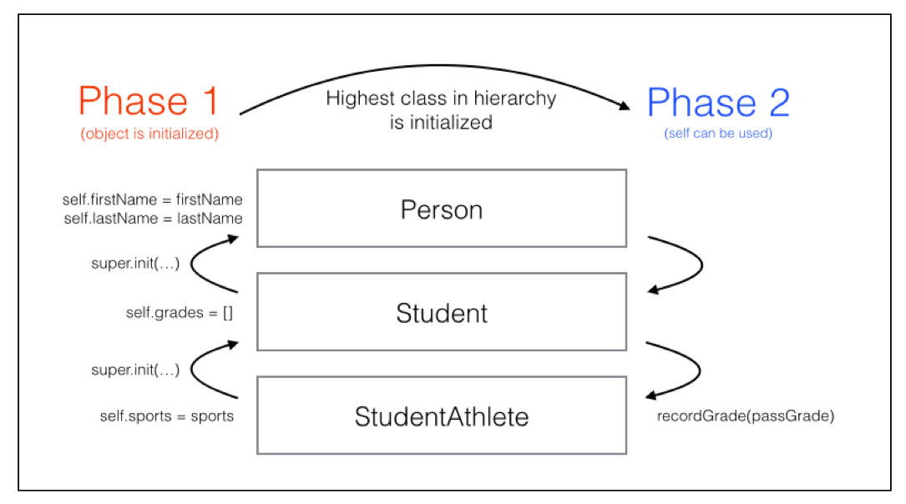

## Structures

**结构体是值类型, 而非引用类型。结构体无处不存在，许多Swift标准类型都是结构体，比如，Array, Int, Float, Double, Bool, Dictionary, Set 和 String都是被定义为结构体。所以它们所有自己的方法和属性。**

```swift
  struct Location { 
    let x: Int 
    let y: Int 
  }
  let storeLocation = Location(x: 2, y: 4) // swift 自动提供的初始化函数，强制必须设置所有属性

  struct DeliveryArea { 
    let center: Location // let 不可修改
    var radius: Double // var 可修改
  }
  var storeArea = DeliveryArea(center: storeLocation, radius: 4) // var 可以修改其可修改属性

  print(storeArea.radius) // 4.0
  print(storeArea.center.x) // 2
  storeArea.radius = 250

  let fixedArea = DeliveryArea(center: storeLocation, radius: 4) // let 结构体属性不可修改
  fixedArea.radius = 250 // Error: Cannot assign to property 

  // copy-on-assignment 结构体是值类型, 而非引用类型
  var area1 = DeliveryArea(center: Location(x: 2, y: 4), radius: 2.5) 
  var area2 = area1 
  print(area1.radius) // 2.5 
  print(area2.radius) // 2.5
  area1.radius = 4 
  print(area1.radius) // 4.0 
  print(area2.radius) // 2.5
```

### Properties

#### 存储属性

```swift
  struct Contact { 
    var fullName: String
    var emailAddress: String
    var relationship = "Friend" //默认属性
  }

  var person = Contact(fullName: "Grace Murray", emailAddress: "grace@navy.mil")
  var person = Contact(
    fullName: "Grace Murray",
    emailAddress: "grace@navy.mil", 
    relationship: "Friend"
  )
```

####计算属性

```swift
  struct TV {
    var height: Double 
    var width: Double
    var diagonal: Int { 
      let result = (height * height + width * width).squareRoot().rounded() 
      return Int(result) 
    }
  }
  var tv = TV(height: 53.93, width: 95.87) 
  let size = tv.diagonal // 110
  tv.width = tv.height 
  let diagonal = tv.diagonal // 76
```

##### Getter and setter

```swift
  var diagonal: Int {
    get {
      let result = (height * height + width * width).squareRoot().rounded() 
      return Int(result)
    } 
    set {
      let ratioWidth = 16.0 
      let ratioHeight = 9.0
      let ratioDiagonal = (ratioWidth * ratioWidth + ratioHeight * ratioHeight).squareRoot() 
      height = Double(newValue) * ratioHeight / ratioDiagonal 
      width = height * ratioWidth / ratioHeight
    }
  }
	tv.diagonal = 70 
	let height = tv.height // 34.32... 
	let width = tv.width // 61.01...
```

#### type properties

类型属性，跨越实例共享

```swift
  struct Level { 
    static var highestLevel = 1 // static 修饰为 type properties 
    let id: Int 
    var boss: String 
    var unlocked: Bool 
  }
  let highestLevel = level3.highestLevel // Error: you can't access a type property on an instance 
  let highestLevel = Level.highestLevel // 1
```

#### property obsevers

- willSet, didSet 仅用于存储属性，计算属性直接使用 getter 和 setter 即可。

- willSet, didSet 在结构体初始化时不会被调用，只有属性更新新值时才会调用。

```swift
  struct Level {
    static var highestLevel = 1 
    let id: Int 
    var boss: String 
    var unlocked: Bool {
      didSet { // obsevers
        if unlocked && id > Level.highestLevel {
          Level.highestLevel = id
        }
      } 
    }
  }
```

##### Limiting a variable

```swift
  struct LightBulb {
    static let maxCurrent = 40 
    var current = 0 { 
      didSet { 
        if current > LightBulb.maxCurrent { 
          print(""" 
                Current is too high, 
                falling back to previous setting. 
                """
               ) 
          current = oldValue 
        } 
      }
    }
  }
  var light = LightBulb() 
  light.current = 50
  var current = light.current // 0 
  light.current = 40 
  current = light.current // 40
```

#### Lazy properties

```swift
  struct Circle {
    lazy var pi = { // lazy 属性必须是变量 (var)
      return ((4.0 * atan(1.0 / 5.0)) - atan(1.0 / 239.0)) * 4.0 
    }() 
    var radius = 0.0 
    var circumference: Double {
      mutating get {
        return pi * radius * 2
      } 
    } 
    init(radius: Double) { // 自定义初始化函数，一旦自定义构造方法，默认构造方法将无效
      self.radius = radius 
    }
  }

  var circle = Circle(radius: 5) // got a circle, pi has not been run
  let circumference = circle.circumference // 31.42 // also, pi now has a value
```

### Methods

```swift
  func distance(from source: (x: Int, y: Int), to target: (x: Int, y: Int)) -> Double {
    let distanceX = Double(source.x - target.x)
    let distanceY = Double(source.y - target.y)
    return (distanceX * distanceX + distanceY * distanceY).squareRoot() 
  }

  struct DeliveryArea { 
    let center: Location
    var radius: Double
    func contains(_ location: Location) -> Bool { // Method
      let distanceFromCenter = 
      distance(from: (center.x, center.y), to: (location.x, location.y))
      return distanceFromCenter < radius
    }
  }

  let area = DeliveryArea(center: Location(x: 5, y: 5), radius: 4.5) 
  let customerLocation = Location(x: 2, y: 2) 
  area.contains(customerLocation) // true
```

#### self

```swift
  let months = ["January", "February", "March", "April", "May", "June", "July", "August", "September", "October", "November", "December"]

  struct SimpleDate { 
    var month: String
    var day: Int
    func monthsUntilWinterBreak() -> Int {
      return months.index(of: "December")! - months.index(of: self.month)! // self
      // return months.index(of: "December")! - months.index(of: month)! // self 可省略
    }
  }
  date.monthsUntilWinterBreak() // 2
```

#### Initializers

```swift
  let date = SimpleDate(month: "January", day: 14) //swift 自动提供的初始化函数，强制必须设置所有属性
  let date = SimpleDate(day: 14) // Error!

  struct SimpleDate { 
    var month: String
    var day: Int
    init(day: Int) { // 自定义初始化函数
      month = "January"
      self.day = day // 都为 "day"，self 不可省
    }
    func monthsUntilWinterBreak() -> Int { 
      return months.index(of: "December")! months.index(of: month)!
    }
  }
  let date = SimpleDate(day: 14) 
  date.month // January 
  date.monthsUntilWinterBreak() // 11
  let date = SimpleDate(month: "February", day: 14) // Error! // 一旦自定义构造方法，默认构造方法将无效
```

#### mutating methods

- 结构体为值类型,  如果一个方法改变了其属性值, 其实例的值须修改。

- 所以有 mutating 方法的结构体不能实例化为常量。
- 用 mutating 修饰的方法, swift 传入的 self 为一个标记为 inout 的参数。

```swift
	struct SimpleDate { 
    var month: String
    var day: Int
    init(day: Int) {
      month = "January"
      self.day = day
    }
    mutating func advance() { // 只有标记了 mutating 的方法才能修改结构体实例的值
      day += 1 
    }
    func monthsUntilWinterBreak() -> Int { 
      return months.index(of: "December")! months.index(of: month)!
    }
  }
```

#### type methods

类型方法，跨越实例共享

```swift
  struct Math { // 可用于 namespace (命名空间)
    static func factorial(of number: Int) -> Int { 
      return (1...number).reduce(1, *) 
    } 
  } 
  Math.factorial(of: 6) // 720
```

### Protocol

```swift
  public protocol CustomStringConvertible { 
    /// A textual representation of this instance. 
    public var description: String { get } 
  }

  struct DeliveryArea: CustomStringConvertible { 
    let center: Location 
    var radius: Double
    var description: String { // 实现协议必须实现其方法
      return """ 
        Area with center: x: \(center.x) - y: \(center.y), 
        radius: \(radius) 
        """ 
    }
    func contains(_ location: Location) -> Bool { // Method
      let distanceFromCenter = 
      distance(from: (center.x, center.y), to: (location.x, location.y))
      return distanceFromCenter < radius
    }
  }
  // print() 调用 description 方法进行输出
  print(area1) // Area with center: x: 2 - y: 4, radius: 4.0 
  print(area2) // Area with center: x: 2 - y: 4, radius: 2.5
```

### Extensions

- 不能在 Extensions 中添加存储属性
- 因为添加存储属性会改变被扩展结构体的内存大小，破坏了被扩展结构体

```swift
  struct Math {
    static func factorial(of number: Int) -> Int { 
      return (1...number).reduce(1, *) 
    } 
  }
  extension Math {
    static func primeFactors(of value: Int) -> [Int] {
      var remainingValue = value
      var testFactor = 2 
      var primes: [Int] = []
      while testFactor * testFactor <= remainingValue { 
        if remainingValue % testFactor == 0 { 
          primes.append(testFactor) remainingValue /= testFactor 
        } else { 
          testFactor += 1 
        }
      }
      if remainingValue > 1 { 
        primes.append(remainingValue) 
      } 
      return primes
    }
  }
  Math.primeFactors(of: 81) // [3, 3, 3, 3]
```

在 Extension 中添加初始化方法，其结构体自动生成的初始化方法将会保留

```swift
  struct SimpleDate { 
    var month: String 
    var day: Int
    func monthsUntilWinterBreak() -> Int { 
      return months.index(of: "December")! - months.index(of: month)!
    }
    mutating func advance() { 
      day += 1 
    }
  }
  extension SimpleDate {
    init() { 
      month = "January" 
      day = 1 
    } 
  }
```

## Class

**类为引用类型**

- 结构体是不可变的值类型，类是可变的引用类型
- 类不像结构体，类没有提供默认构造方法，必须要写构造方法显式的给所有属性赋值
- 类通常用来代表对象，结构体用来代表值
- 结构体用栈更快，类用堆较慢
- 需较多的短暂使用的实例用结构体，需较少的长生命周期的实例用类
- 不改变的简单数据存储用结构体，需要更新数据更新状态存储逻辑时用类。尽量先用栈，如果需要添加类的能力时再改为类。
- == 比较值是否相等，=== 比较内存地址是否相等

```swift
  class Person {
    var firstName: String 
    var lastName: String
  	init(firstName: String, lastName: String) { 
      self.firstName = firstName 
      self.lastName = lastName 
    }
  	var fullName: String { 
      return "\(firstName) \(lastName)" 
    }
  }
  let john = Person(firstName: "Johnny", lastName: "Appleseed")
  var homeOwner = john 
	john.firstName = "John" // John wants to use his short name! 
	john.firstName // "John" 
	homeOwner.firstName // "John"
```

```swift
  struct Grade { 
    let letter: String 
    let points: Double 
    let credits: Double 
  }

  class Student {
    var firstName: String 
    var lastName: String 
    var credits = 0.0
    var grades: [Grade] = []
    init(firstName: String, lastName: String) { 
      self.firstName = firstName 
      self.lastName = lastName 
    }
    func recordGrade(_ grade: Grade) { 
      grades.append(grade) 
      credits += grade.credits
    }
  }
  let jane = Student(firstName: "Jane", lastName: "Appleseed") 
  let history = Grade(letter: "B", points: 9.0, credits: 3.0) 
  var math = Grade(letter: "A", points: 16.0, credits: 4.0)
  jane.recordGrade(history) 
  jane.recordGrade(math)

  jane = Student(firstName: "John", lastName: "Appleseed") // Error: jane is a `let` constant

  jane.credits // 7

  // The teacher made a mistake; math has 5 credits 
  math = Grade(letter: "A", points: 20.0, credits: 5.0) 
  jane.recordGrade(math)
  jane.credits // 12, not 8!
```

### Extensions

```swift
  extension Student { 
    var fullName: String { 
      return "\(firstName) \(lastName)" 
    } 
  }
```

### 继承

```swift
  struct Grade { 
    var letter: Character 
    var points: Double 
    var credits: Double 
  }

  class Person {
    var firstName: String 
    var lastName: String
    init(firstName: String, lastName: String) { 
      self.firstName = firstName 
      self.lastName = lastName 
    }
  }

  class Student: Person { 
    var grades: [Grade] = []
    func recordGrade(_ grade: Grade) { 
      grades.append(grade)           
    }
  }

  let john = Person(firstName: "Johnny", lastName: "Appleseed") 
  let jane = Student(firstName: "Jane", lastName: "Appleseed")
  john.firstName // "John" 
  jane.firstName // "Jane"

  let history = Grade(letter: "B", points: 9.0, credits: 3.0) 
  jane.recordGrade(history) 
  // john.recordGrade(history) // john is not a student!

  class BandMember: Student {
    var minimumPracticeTime = 2 
  }
  class OboePlayer: BandMember {
    override var minimumPracticeTime: Int { // 重写
      get { 
        return super.minimumPracticeTime * 2 
      } 
      set { 
        super.minimumPracticeTime = newValue / 2 
      } 
    }
  }
```

#### final

#####阻止子类继承

```swift {1}
final class FinalStudent: Person {} 
class FinalStudentAthlete: FinalStudent {} // Build error!
```

##### 阻止子类重写方法

```swift
class AnotherStudent: Person { 
  final func recordGrade(_ grade: Grade) {} 
}
class AnotherStudentAthlete: AnotherStudent { 
  override func recordGrade(_ grade: Grade) {} // Build error! 
}
```

### 多态

```swift
  func phonebookName(_ person: Person) -> String { 
    return "\(person.lastName), \(person.firstName)" 
  }

  let person = Person(firstName: "Johnny", lastName: "Appleseed") 
  let oboePlayer = OboePlayer(firstName: "Jane", lastName: "Appleseed")

  phonebookName(person) // Appleseed, Johnny 
  phonebookName(oboePlayer) // Appleseed, Jane
```

#### 父子类型转换

```swift
  var hallMonitor = Student(firstName: "Jill", lastName: "Bananapeel")
  hallMonitor = oboePlayer

  oboePlayer as Student // 子类转为父类, 编译时期便可确定其正确性
  (oboePlayer as Student).minimumPracticeTime // ERROR: 不再是 BandMember, 不能访问其属性

  hallMonitor as? BandMember // 父类转子类, 为 Optional, 如果转换失败则为 nil
  (hallMonitor as? BandMember)?.minimumPracticeTime // 4 (optional)

  hallMonitor as! BandMember // 强制转换, 如果失败, 程序将崩溃
  (hallMonitor as! BandMember).minimumPracticeTime // 4 (force unwrapped)

  if let hallMonitor = hallMonitor as? BandMember { // 使用 if let
    print("This hall monitor is a band member and practices at least \(hallMonitor.minimumPracticeTime) hours per week.") 
  }
```

#### static dispatch

**子类转为父类的使用场景**

```swift
  func afterClassActivity(for student: Student) -> String { 
    return "Goes home!"
  }
  func afterClassActivity(for student: BandMember) -> String { 
    return "Goes to practice!"
  }
  // Swift’s dispatch rules: 调用类型最精确匹配的方法 
  afterClassActivity(for: oboePlayer) // Goes to practice! 
  afterClassActivity(for: oboePlayer as Student) // Goes home!
```

### Override

```swift
  class StudentAthlete: Student { 
    var failedClasses: [Grade] = []
    override func recordGrade(_ grade: Grade) { // 重写方法，必须要用 Override 修饰
      super.recordGrade(grade) // super 调用父类方法
      if grade.letter == "F" { 
        failedClasses.append(grade) 
      }
    }
    var isEligible: Bool {
      return failedClasses.count < 3 
    }
  }
```

### 生命周期

####初始化

```swift
  class StudentAthlete: Student { 
    var sports: [String]
    init(sports: [String]) { 
      self.sports = sports 
      // Build error - super.init isn’t called before 
      // returning from initializer 
    }
  }

  class StudentAthlete: Student { 
    var sports: [String]
    init(firstName: String, lastName: String, sports: [String]) { 
      self.sports = sports 
      super.init(firstName: firstName, lastName: lastName) 
    }
  }
```

- Phase 1:  由子类到父类初始化所有存储属性，直到此阶段完成，才能使用属性和方法
- Phase2:  可以使用属性和方法，并且也可以使用 self



```swift
  class StudentAthlete: Student { 
    var sports: [String]
    init(firstName: String, lastName: String, sports: [String]) {
      self.sports = sports // phase 1
      let passGrade = Grade(letter: "P", points: 0.0, credits: 0.0) // 可以创建局部属性，但不能调用属性和方法
      super.init(firstName: firstName, lastName: lastName) // 完成后进入 phase 2
      recordGrade(passGrade) // phase 2, 可以使用属性和方法以及 self
    }
  }
```

##### required

```swift
  class Student {
    let firstName: String 
    let lastName: String 
    var grades: [Grade] = []
    required init(firstName: String, lastName: String) { // 强制所有子类必须重写
      self.firstName = firstName 
      self.lastName = lastName 
    }
    init(transfer: Student) {
      self.firstName = transfer.firstName 
      self.lastName = transfer.lastName 
    }
    func recordGrade(_ grade: Grade) { 
      grades.append(grade) 
    }
  }

  class StudentAthlete: Student { 
    // Now required by the compiler!
    required init(firstName: String, lastName: String) { // 有 required 修饰，Override 可省略
      self.sports = [] 
      super.init(firstName: firstName, lastName: lastName) 
    }
    ...
  }
```

##### convenience

```swift
  class Student { 
    let firstName: String 
    let lastName: String 
    var grades: [Grade] = []
    required init(firstName: String, lastName: String) {
      self.firstName = firstName 
      self.lastName = lastName 
    }
    convenience init(transfer: Student) { // convenience 强制直接或间接调用其他 non-convenience initializer
      self.init(firstName: transfer.firstName, lastName: transfer.lastName) 
    } 
    func recordGrade(_ grade: Grade) { 
      grades.append(grade) 
    }
  }
```

#### 析构 (deinitializer)

- 非必须, 自动被 swift 调用
- 不能被重写, 内部不能调用 super
- swift 确保会在每个类析构时调用 deinit
- 经常用于一些清理类型的工作

```swift
  class Person { 
    ... 
    deinit { 
      print("\(firstName) \(lastName) is being removed from memory!")      
    } 
  }
```

#### 引用计数

**automatic reference counting (ARC) **

Swift 编译器在编译期间会自动添加增减引用计数的方法调用

```swift
  var someone = Person(firstName: "Johnny", lastName: "Appleseed") 
  // Person object has a reference count of 1 (someone variable)
  var anotherSomeone: Person? = someone 
  // Reference count 2 (someone, anotherSomeone)
  var lotsOfPeople = [someone, someone, anotherSomeone, someone] 
  // Reference count 6 (someone, anotherSomeone, 4 references in lotsOfPeople)
  anotherSomeone = nil 
  // Reference count 5 (someone, 4 references in lotsOfPeople)
  lotsOfPeople = [] 
  // Reference count 1 (someone)
  someone = Person(firstName: "Johnny", lastName: "Appleseed") 
  // Reference count 0 for the original Person object!
  // Variable someone now references a new object
```

##### 循环引用

```swift
  class Student: Person { 
    var partner: Student?
    ...
    deinit { 
      print("\(firstName) is being deallocated!") } 
  }

  var alice: Student? = Student(firstName: "Alice", lastName: "Appleseed") 
  var bob: Student? = Student(firstName: "Bob", lastName: "Appleseed")

  alice?.partner = bob 
  bob?.partner = alice

  alice = nil 
  bob = nil
  // deinit 并没有调用
```

##### 弱引用

```swift
class Student: Person { 
  weak var partner: Student?
  ...
}
```

## Enumerations

```swift
  enum Month {
    case january 
    case february 
    case march 
    case april 
    case may 
    case june 
    case july 
    case august 
    case september 
    case october 
    case november 
    case december
  }
  // 等价于
  enum Month { 
    case january, february, march, april, may, june, july, august, september, october, november, december 
  }

  func semester(for month: Month) -> String {
    switch month { 
      case Month.august, Month.september, Month.october, Month.november, Month.december:
        return "Autumn" 
      case Month.january, Month.february, Month.march, Month.april, Month.may:
        return "Spring" 
      default:
        return "Not in the school year" 
    }
  }
  // 等价于
  func semester(for month: Month) -> String {
    switch month { 
      case .august, .september, .october, .november, .december:
        return "Autumn" 
      case .january, .february, .march, .april, .may:
        return "Spring" 
      default:
        return "Not in the school year" 
    }
  }

  var month = Month.april 
	semester(for: month) // "Spring"
	month = .september 
	semester(for: month) // "Autumn"
```

- 枚举有有限个值, switch 只要对这些值有全面处理，可以没有 default, 否则必须要有 default 保证全面的条件处理
- 枚举，全面条件处理不用 default，会有另一个好处：当枚举增加或减少枚举项时，swift 编译器会报错提醒你需要修改 switch

```swift
	func semester(for month: Month) -> String {
    switch month { 
      case .august, .september, .october, .november, .december:
        return "Autumn" 
      case .january, .february, .march, .april, .may:
        return "Spring"
      case .june, .july:
      	return "Summer"
    }
  }
```

### Raw values

- swift 枚举项默认的 Raw values 并不是 integer, 与 C 语言不同
- 但是你可以手动指定 Raw values

```swift
  enum Month: Int { // 指定为 Int, 也可以是 String, Float, Character 等
    // january 为 0, 其他依次递增
    case january, february, march, april, may, june, july, august, september, october, november, december 
  }

  enum Month: Int {
    // 指定 january 为 1, 其他依次递增
    case january=1, february, march, april, may, june, july, august, september, october, november, december 
  }

	enum Coin: Int { 
    case penny = 1 
    case nickel = 5 
    case dime = 10 
    case quarter = 25 
  }
  let coin = Coin.quarter 
  coin.rawValue // 25
```

访问 Raw value

```swift
	func monthsUntilWinterBreak(from month: Month) -> Int { 
    return Month.december.rawValue - month.rawValue // 访问 Raw value
  } 
  monthsUntilWinterBreak(from: .april) // 8
```

用 Raw value 初始化枚举

```swift
	let fifthMonth = Month(rawValue: 5) // 不能保证存在此 rawValue 的枚举，故返回 optional
  monthsUntilWinterBreak(from: fifthMonth) // Error: not unwrapped

  let fifthMonth = Month(rawValue: 5)! 
  monthsUntilWinterBreak(from: fifthMonth) // 7
```

#### String raw values

```swift
  enum Icon: String { // 指定为 String
    // 如果不指定，默认自动为与枚举项名称相同的字符串
    case music 
    case sports 
    case weather
    var filename: String { 
      return "\(rawValue).png" 
    }
  } 
  let icon = Icon.weather 
  icon.filename // weather.png
```

### Associated values

- 每个枚举 case 可以有0个或多个关联值（Associated values）
- 每个枚举 case的关联值都可以有自己的数据类型
- 可以像命名函数参数那样命名关联值
- 一个枚举不能同时有 Raw values 或 Associated values

```swift
  var balance = 100
  enum WithdrawalResult {
    case Success(Int)
    case Error(String)
  }
  func withdraw(amount: Int) -> WithdrawalResult {
   	if amount <= balance {
     	balance -= amount
     	return .Success(balance)
   	} else {
     	return .Error("Not enough money!")
  	}
  }

  let result = withdraw(99)
  switch result {
  case let .Success(newBalance):
    print("Your new balance is: \(newBalance)")
  case let .Error(message):
    print(message)
  }
	// Your new balance is: 1
```

与 if case 或 guard case 一起使用

```swift
  enum HTTPMethod {
    case GET
    case POST(String)
  }
	let request = HTTPMethod.post(body: "Hi there") 
	guard case .post(let body) = request else { // guard case, 是否 request 包含 post 枚举项, 包含则绑定关联值
    fatalError("No message was posted") 
  } 
	print(body) // 打印关联值
```

枚举可以用作 **状态机 ( state machine )**

```swift
  enum TrafficLight {
    case Red, Yellow, Green
  }
  let trafficLight = TrafficLight.Red
```


### 遍历

```swift
  enum Pet: CaseIterable { 
    case cat, dog, bird, turtle, fish, hamster 
  }

  for pet in Pet.allCases { 
    print(pet) 
  }
```

###用枚举做命名空间

- [结构体可以有相同用法](#type methods)，但结构体可以创建实例，命名空间不需要创建实例，所以用枚举实现命名空间会更好
- 创建枚举实例必须指定枚举项，没有枚举项的枚举便不能创建实例

```swift
  enum Math { 
    static func factorial(of number: Int) -> Int {
      return (1...number).reduce(1, *) 
    } 
  } 
  let factorial = Math.factorial(of: 6) // 720

  let math = Math() // ERROR: No accessible initializers
```

### Optional

**Optionals 就是用关联值的枚举**

```swift
  var age: Int? 
  age = 17 
  age = nil

  switch age { 
    case .none:
      print("No value") 
    case .some(let value):
      print("Got a value: \(value)") 
  }

  let optionalNil: Int? = .none 
  optionalNil == nil // true 
  optionalNil == .none // true
```

## Protocols

```swift
  protocol Vehicle { 
    func accelerate() 
    func stop() 
  }

  class Unicycle: Vehicle { //实现 Vehicle 协议，必须实现其所有方法
    var peddling = false
    func accelerate() { 
      peddling = true 
    }
    func stop() { 
      peddling = false 
    }
  }
```

### Methods

```swift
  enum Direction { 
    case left 
    case right 
  }
  protocol DirectionalVehicle { 
    func accelerate() 
    func stop() 
    func turn(_ direction: Direction) 
    func description() -> String 
  }
```

协议 Methods 不能有任何有关实现的代码，包括默认参数

```swift
  protocol OptionalDirectionVehicle { 
    // Build error!
  	func turn(_ direction: Direction = .left) 
  }
	// 需要用重载实现
	protocol OptionalDirectionVehicle { 
    func turn() 
    func turn(_ direction: Direction) 
  }
```

### Properties

- 需要明确指定属性是 get 还是 set
- 不能包含任何属性的实现代码
- 可以用计算属性或存储属性去实现

```swift
  protocol VehicleProperties { 
    var weight: Int { get } 
    var name: String { get set } 
  }
```

### 初始化

```swift
  protocol Account { 
    var value: Double { get set } 
    init(initialAmount: Double) 
    init?(transferAccount: Account) 
  }
  class BitcoinAccount: Account {
    var value: Double 
    required init(initialAmount: Double) {
      value = initialAmount 
    } 
    required init?(transferAccount: Account) {
      guard transferAccount.value > 0.0 else {
        return nil
      }
      value = transferAccount.value 
    }
  }

  var accountType: Account.Type = BitcoinAccount.self 
  let account = accountType.init(initialAmount: 30.00) 
  let transferAccount = accountType.init(transferAccount: account)!
```

### 继承

```swift
  protocol WheeledVehicle: Vehicle { 
    var numberOfWheels: Int { get } 
    var wheelSize: Double { get set } 
  }
```

### 实现协议

```swift
  class Bike: Vehicle {
    var peddling = false 
    var brakesApplied = false
    func accelerate() { 
      peddling = true 
      brakesApplied = false 
    }
    func stop() { 
      peddling = false 
      brakesApplied = true 
    }
  }
```

#### 实现属性

实现 { get } 的属性

- 存储属性常量
- 存储属性变量
- 只读计算属性
- 可读可写计算属性

实现 { get set } 的属性

- 存储属性变量
- 可读可写计算属性

```swift
  class Bike: WheeledVehicle {
    // 实现属性
    let numberOfWheels = 2 
    var wheelSize = 16.0

    var peddling = false 
    var brakesApplied = false
    func accelerate() { 
      peddling = true 
      brakesApplied = false 
    }
    func stop() { 
      peddling = false 
      brakesApplied = true 
    }
  }
```

#### Associated types

- 只是简单声明一个类型，需在协议中使用
- 不限制类型是什么，实现类来决定

```swift
  protocol WeightCalculatable { 
    associatedtype WeightType 
    var weight: WeightType { get } 
  }

  class HeavyThing: WeightCalculatable {
    // This heavy thing only needs integer accuracy 
    typealias WeightType = Int // 由于类型推导，可省略
    var weight: Int { 
      return 100 
    }
  }

  class LightThing: WeightCalculatable {
    // This light thing needs decimal places 
    typealias WeightType = Double // 由于类型推导，可省略
    var weight: Double { 
      return 0.0025 
    }
  }

  // 因为 associatedtype 没有确定，WeightCalculatable 不能用于变量声明
  let weightedThing: WeightCalculatable = LightThing() // Build error!
```

#### 实现多个协议

```swift
  protocol Wheeled { 
    var numberOfWheels: Int { get } 
    var wheelSize: Double { get set } 
  }
  class Bike: Vehicle, Wheeled { 
    // Implement both Vehicle and Wheeled 
  }
```

#### protocol composition

```swift
	func roundAndRound(transportation: Vehicle & Wheeled) { // 类型需要同时实现 Vehicle 和 Wheeled 协议
    transportation.stop() 
    print("The brakes are being applied to \(transportation.numberOfWheels) wheels.") 
  }
  roundAndRound(transportation: Bike()) // The brakes are being applied to 2 wheels.
```

#### 用扩展实现协议

可以扩展 swift 标准库里的类型来实现协议

```swift
  protocol Reflective { 
    var typeName: String { get } 
  }
  extension String: Reflective { 
    var typeName: String { 
      return "I'm a String" 
    } 
  }
  let title = "Swift Apprentice!" 
  title.typeName // I'm a String
```

- 可以用扩展将代码按照协议实现来分组，使代码更条理
- 如要移除协议实现只需删掉相应的扩展即可
- 因扩展里不能添加存储属性，只能在原来类型里存储，所以完全在扩展里实现协议是不可能的

```swift
  class AnotherBike: Wheeled { 
    var peddling = false 
    let numberOfWheels = 2 
    var wheelSize = 16.0 
  }

  extension AnotherBike: Vehicle { 
    func accelerate() { 
      peddling = true 
    }
    func stop() { 
      peddling = false 
    }
  }
```

#### 实现协议类型

- 值类型 ( structs, enums ) 实现协议
- 引用类型 ( class ) 可实现协议
- 用协议声明的变量是值类型还是引用类型需要运行时动态确定
- 可以指定来限制实现的类型

```swift
  protocol Named { 
    var name: String { get set } 
  }

  class ClassyName: Named { 
    var name: String 
    init(name: String) { 
      self.name = name 
    } 
  }

  struct StructyName: Named { 
    var name: String 
  }

  // 引用类型
  var named: Named = ClassyName(name: "Classy") 
  var copy = named
  named.name = "Still Classy" 
  named.name // Still Classy 
  copy.name // Still Classy

  // 值类型
  named = StructyName(name: "Structy") 
  copy = named
  named.name = "Still Structy?" 
  named.name // Still Structy? 
  copy.name // Structy

  // 指定实现类型必须为 class，此时协议类型确定为引用类型
  protocol Named: class { 
    var name: String { get set } 
  }
```

### 标准库中的协议

#### Equatable

```swift
  protocol Equatable { 
    static func ==(lhs: Self, rhs: Self) -> Bool 
  }
```

```swift
  class Record {
    var wins: Int 
    var losses: Int
    init(wins: Int, losses: Int) { 
      self.wins = wins 
      self.losses = losses
    }
  }

  let recordA = Record(wins: 10, losses: 5) 
  let recordB = Record(wins: 10, losses: 5)
  recordA == recordB // Build error!


  extension Record: Equatable { 
    static func ==(lhs: Record, rhs: Record) -> Bool { 
      return lhs.wins == rhs.wins && lhs.losses == rhs.losses
    } 
  }
  recordA == recordB // true
```

#### Comparable

```swift
  protocol Comparable: Equatable { 
    static func <(lhs: Self, rhs: Self) -> Bool 
    static func <=(lhs: Self, rhs: Self) -> Bool 
    static func >=(lhs: Self, rhs: Self) -> Bool 
    static func >(lhs: Self, rhs: Self) -> Bool 
  }
```

```swift
  extension Record: Comparable { 
    static func <(lhs: Record, rhs: Record) -> Bool { 
      if lhs.wins == rhs.wins { 
        return lhs.losses > rhs.losses 
      } 
      return lhs.wins < rhs.wins 
    } 
  }
  // 实现了 Equatable 和 Comparable 就可以解锁很方法，如: sort, max, min, starts, contains 等
  let teamA = Record(wins: 14, losses: 11) 
  let teamB = Record(wins: 23, losses: 8) 
  let teamC = Record(wins: 23, losses: 9) 
  var leagueRecords = [teamA, teamB, teamC]
  leagueRecords.sort() 
  // {wins 14, losses 11} 
  // {wins 23, losses 9} 
  // {wins 23, losses 8}
  leagueRecords.max() // {wins 23, losses 8} 
  leagueRecords.min() // {wins 14, losses 11} 
  leagueRecords.starts(with: [teamA, teamC]) // true 
  leagueRecords.contains(teamA) // true
```

#### Hashable

- 用于字典的 key 或  Set 中的元素时, 必须实现此协议
- 值类型会自动实现 Equatable 和 Hashable
- 引用类型需要自己实现
- hash 值用于在集合中快速搜索

```swift
  class Student {
    let email: String 
    let firstName: String 
    let lastName: String
    init(email: String, firstName: String, lastName: String) { 
      self.email = email 
      self.firstName = firstName 
      self.lastName = lastName 
    }
  }

  extension Student: Hashable {
    static func ==(lhs: Student, rhs: Student) -> Bool { 
      return lhs.email == rhs.email && 
        lhs.firstName == rhs.firstName && 
        lhs.lastName == rhs.lastName 
    }

    func hash(into hasher: inout Hasher) { 
      hasher.combine(email) 
      hasher.combine(firstName) 
      hasher.combine(lastName) 
    }
  }

  let john = Student(email: "johnny.appleseed@apple.com", firstName: "Johnny", lastName: "Appleseed") 
  let lockerMap = [john: "14B"]
```

#### CustomStringConvertible

```swift
  protocol CustomStringConvertible { 
    var description: String { get } 
  }
```

```swift
  print(john) // Student

  extension Student: CustomStringConvertible { 
    var description: String { 
      return "\(firstName) \(lastName)"                     
    } 
  } 
  print(john) // Johnny Appleseed
```

## Generics

###Values defined by other values

```swift
  enum PetKind { 
    case cat 
    case dog 
  }
  struct KeeperKind { 
    var keeperOf: PetKind 
  }
  let catKeeper = KeeperKind(keeperOf: .cat) 
  let dogKeeper = KeeperKind(keeperOf: .dog)
```

###Types defined by other types

```swift
  class Cat {} 
  class Dog {}
  class Keeper<Animal> {}
  var aCatKeeper = Keeper<Cat>()
  var aDogKeeper = Keeper<Dog>()

  var aKeeper = Keeper() // compile-time error!
```

```swift
  class Cat {
    var name: String
    init(name: String) { 
      self.name = name 
    }
  } 
  class Dog {
    var name: String
    init(name: String) { 
      self.name = name 
    }
  }
  class Keeper<Animal> {
    var name: String 
    var morningCare: Animal 
    var afternoonCare: Animal
    init(name: String, morningCare: Animal, afternoonCare: Animal) { 
      self.name = name 
      self.morningCare = morningCare 
      self.afternoonCare = afternoonCare 
    }
  }
  let jason = Keeper(name: "Jason", morningCare: Cat(name: "Whiskers"), afternoonCare: Cat(name: "Sleepy"))
```

###Type constraints

```swift
  protocol Pet { 
    var name: String { get } 
  } 
  extension Cat: Pet {} 
  extension Dog: Pet {}
  class Keeper<Animal: Pet> {
    ...
  }
```

#### where

```swift
  extension Array where Element: Cat { 
    func meow() { 
      forEach { 
        print("\($0.name) says meow!") 
      } 
    } 
  }
```

```swift
  protocol Meowable { 
    func meow() 
  }

  extension Cat: Meowable { 
    func meow() { 
      print("\(self.name) says meow!")        
    } 
  }

  extension Array: Meowable where Element: Meowable { 
    func meow() { 
      forEach { $0.meow() } 
    } 
  }
```

### 可用泛型的类型

#### Array

```swift
  let animalAges: [Int] = [2,5,7,9]
  // 等价于
  let animalAges: Array<Int> = [2,5,7,9]

  let array = [Int]()
  // 等价于
  let array = Array<Int>()
```

#### Dictionary

```swift
  struct Dictionary<Key: Hashable, Value>
```

```swift
  let intNames: Dictionary<Int, String> = [42: "forty-two"]
  let intNames2: [Int: String] = [42: "forty-two", 7: "seven"] 
  let intNames3 = [42: "forty-two", 7: "seven"] // 类型推导
```

#### Optional

```swift
  enum OptionalDate { 
    case none 
    case some(Date) 
  }
  enum OptionalString { 
    case none 
    case some(String) 
  }
  struct FormResults { 
    // other properties here 
    var birthday: OptionalDate 
    var lastName: OptionalString 
  }

  enum Optional<Wrapped> { // swift 内部 Optional 的近似实现
    case none
    case some(Wrapped) 
  }

  var birthdate: Optional<Date> = .none 
  if birthdate == .none { 
    // no birthdate 
  }

  var birthdate: Date? = nil
  if birthdate == nil { 
    // no birthdate 
  }
```

###Generic function parameters

```swift
  func swapped<T, U>(_ x: T, _ y: U) -> (U, T) { 
    return (y, x) 
  }
  swapped(33, "Jay")
  // returns ("Jay", 33)
```