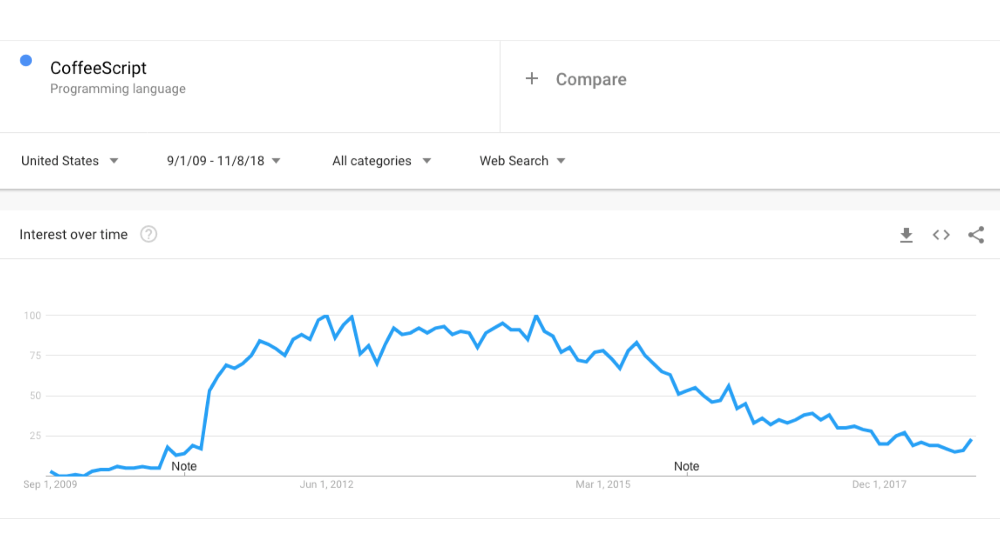
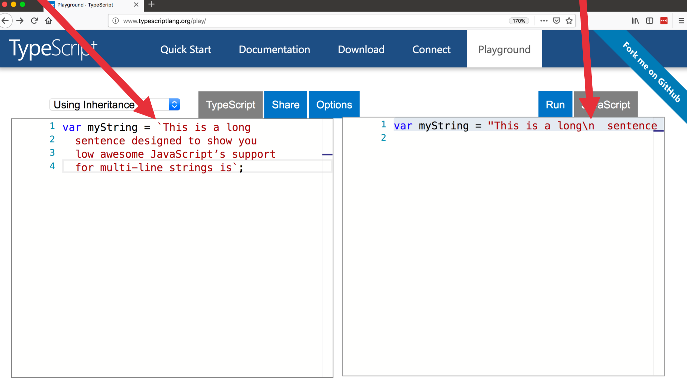

##Compile to JavaScript tools

能编译为 JavaScript 的工具非常之多

- https://github.com/jashkenas/coffeescript/wiki/List-of-languages-that-compile-to-JS
  - Ruby, Python, Erlang, Java, Scala, C#, F#, Lisp, Scheme, Haskell, Smalltalk, C, C++, Basic, Go, PHP, … ...
- [CoffeeScript](https://coffeescript.org/)
- [Dart](https://www.dartlang.org/)
- [TypeScript](http://www.typescriptlang.org/)

## CoffeeScript

#### 流行一时

#### Ruby 形式的语法

这种语法使 JavaScript 开发者的学习曲线陡增

## Dart

####AOT 编译, 也可以 JIT 编译

- AOT (Ahead Of Time), 静态语言, 如: C
- JIT (Just In Time), 动态语言, 如: Javascript

JIT 编译在开发过程中使用，编译器速度特别快。然后，当一个应用程序准备发布时，它被 AOT 编译。因此，借助先进的工具和编译器，Dart 具有两全其美的优势：极快的开发周期、快速的执行速度和极短启动时间。

Dart 可以[编译成 JavaScript](https://webdev.dartlang.org/tools/dart2js)，所以浏览器可以执行

由 Google 创建的，Chrome 开始流行时，Dart流行一时，曾被认为会代替 JavaScript

####Dart 并没有那么成功

Dart语法再当时更像 C# 或 Java ( 当时2011年 JavaScript 没有 class )，所以当时 JavaScript 开发者对其语法并不熟悉，学习曲线很高。另外，在当时，一个 Hello World 的Dart程序编译成 Javascript 会有大量代码。

现在 Dart 并非专注于 Web，Dart 2 的改进集中在优化客户端开发。Dart 也淡出 Compile to JavaScript 工具阵营。

[Flutter](https://flutter.io)

## TypeScript

由 Microsoft 2012年10月发布

####一直表现平平

2014 年，Microsoft 并不 cool，在 JavaScript 世界没有突出贡献

TypeScript 工具集和 Visual Studio 捆绑，在 Visual Studio 中才会有好的开发体验，但 JavaScript 世界几乎没有人使用 Visual Studio。因为 Visual Studio 收费，并且当时只能在 Window 平台使用。

所以当时几乎没有人动力去知道 TypeScript，写 TypeScript，也没人讨论 TypeScript

而且还有类似这样的一些反对声音:

#### 事情改变了

2015年2月事情开始改变

原因如下：

1. Angular 2 采用 TypeScript，Angular 拥有众多用户，TypeScript 开始进入人们的视野

2. Microsoft 发布了 Visual Studio Code，跨平台且免费，可以说是至今最成功的代码编辑器。TypeScript 的成功很大程度要归功于 Visual Studio Code 的流行。

####越来越流行

Vue 3.0 将使用 TypeScript

Create React App 也官方支持了 TypeScript

#### 这是为什么呢？

- 得益于Microsoft 的 推广，更重要的是 TypeScript 真的解决了 JavaScript 功能缺陷的实际问题

- 完全遵守 ECMAScript 标准，这和 CoffeeScript 和 Dart 完全不同

  - "Some examples [of compile-to-JavaScript frameworks], **like Dart, portend that JavaScript has fundamental flaws and to support these scenarios requires a “clean break” from JavaScript in both syntax and runtime**. We disagree with this point of view. We believe that with committee participant focus, the standards runtime can be expanded and the syntactic features necessary to support **JavaScript at scale can be built upon the existing JavaScript standard.**" (来自 Microsoft 首次发布 TypeScript 的博客)

    

  - 兼容 Javascript, 是其超集

    - **JavaScript 是合法的 TypeScript， 这意味着用 TypeScript 不用更改原来的 JavaScript 代码，可以循序渐进的增加 TypeScript 的类型特征，这使得学习曲线接近于0**

      

      

  - 马上可用的 ES6 ES7… 最新语法 

    - 类和继承

      

      
    - 箭头函数

      
    - 多行字符串

      
    - 模板字面字符串

      

  - 丰富的编译选项

    - **默认编译为 ES3, 如果不必支持老浏览器或写 node 应用，可以方便的更改编译选项为 ES5, ES6, … …**
    - 

- 类型 (Types) 

  - 类型 (Types)都是是可选的, 进一步减低了学习曲线

    

    

  - TypeScript 会利用内置的类型和类型定义来分析代码，进行类型推导和类型检查

    

    

    

  - 静态类型检查只在编译时期，运行时不会增加额外代码，不会给运行时造成性能开销，

    

- **Tooling** - By far, the most **significant** value of TypeScript is **the developer tooling** it enables.

  - 类型推导加上强大的代码编辑器 ([Atom](https://atom.io/packages/atom-typescript), [**Visual Studio Code**](https://code.visualstudio.com/docs/languages/typescript), [Sublime](https://github.com/Microsoft/TypeScript-Sublime-Plugin)) **可提供感知上下文的代码提示**
  
    
  
  - 强大生态
    
    大量TypeScript兼容的第三方库，你用到的几乎都有
    
    
    
    
    
    
    
    
    
  - 强大的 [DefinitelyTyped](https://github.com/DefinitelyTyped/DefinitelyTyped)
  
  - 搜索方便 http://microsoft.github.io/TypeSearch/

#### 问题

- 怎么开始?
  
  
  
  
  
  http://www.typescriptlang.org/samples/index.html
- TypeScript vs Flow?
  
  Flow 也是静态类型检查，直接作用于 JavaScript 文件，应该说是一种更简洁的方式Flow 也是静态类型检查，直接作用于 JavaScript 文件，应该说是一种更简洁的方式，但 Flow 有些慢，因为 Flow 没有自己的独立文件，而是作用于 JavaScript 文件，所以处理时可以利用的信息会更少，需要做更多的分析处理。而 TypeScript 却非常快，代码提示也迅速。
  
  
  
  https://flow.org/
- TypeScript 的缺点 ?
  - 学习曲线？
    
    有其他强类型语言经历的开发者一两个小时即可完全掌握但纯 JavaScript 原生没有强类型语言经历的开发者可能会有稍高的学习曲线，不过初学者可以循序渐进的增加 TypeScript 的语言特征。
    
    
  - 配置繁多？
    
    

#### TypeScript 总结

- 编译时期静态类型推导和类型检查
  - 弥补 JavaScript 的天生缺陷
  - 极大降低代码 bug
  - 性能没有损失
  - 结合现代代码编辑器，智能提示，极大提高了开发速度和质量

- 学习曲线低
- 工具集丰富，强大生态
- 尤其适合大型应用和团队开发
  - 团队越大，代码量越大，你会发现 TypeScript 的价值越大

